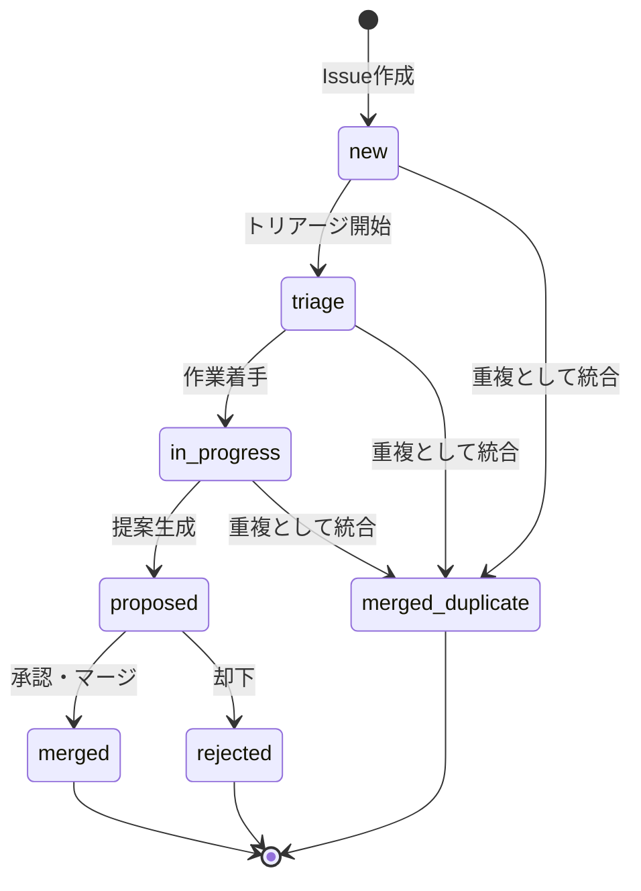

# Issue Management Skill

## 概要

このスキルは FlowOps プロジェクトにおける Issue のライフサイクル全体を管理します。
重複統合（Duplicate Merge）機能を含む堅牢なIssue管理を提供します。

## 責務

1. **Issue CRUD**
   - 作成・読取・更新・削除
   - ステータス遷移管理
   - humanId の自動生成（ISS-001形式）

2. **Proposal管理**
   - LLM生成またはマニュアル入力
   - 適用（Apply）と履歴管理

3. **Evidence管理**
   - スクリーンショット、リンク、テキストログの添付
   - 重複統合時のEvidence引き継ぎ

4. **重複統合（Duplicate Merge）**
   - Issue B を Issue A に統合
   - ブランチのcherry-pick処理

## 実装パス

```
app/
├── api/
│   └── issues/
│       ├── route.ts              # CRUD
│       ├── [id]/
│       │   ├── start/route.ts    # 作業開始
│       │   ├── merge-close/route.ts
│       │   └── merge-duplicate/route.ts
core/
├── issue/
│   ├── service.ts         # ビジネスロジック
│   ├── duplicate.ts       # 重複統合ロジック
│   └── humanId.ts         # ID生成
```

## ステータス遷移



## ステータス定義

| ステータス         | 説明                     | 次のアクション         |
| ------------------ | ------------------------ | ---------------------- |
| `new`              | 新規作成                 | トリアージ or 重複統合 |
| `triage`           | トリアージ中             | 作業着手 or 重複統合   |
| `in-progress`      | 作業中（ブランチ作成済） | 提案生成               |
| `proposed`         | 提案あり                 | 適用 or 却下           |
| `merged`           | マージ完了               | -                      |
| `rejected`         | 却下                     | -                      |
| `merged-duplicate` | 重複として統合済         | -                      |

## 重複統合ロジック

```typescript
async function mergeDuplicate(duplicateId: string, canonicalId: string) {
  const duplicate = await getIssue(duplicateId);
  const canonical = await getIssue(canonicalId);

  // ブランチにコミットがあるか確認
  if (duplicate.branchName) {
    const hasCommits = await gitManager.hasCommits(duplicate.branchName);

    if (hasCommits) {
      // コミットがある場合は cherry-pick
      await gitManager.cherryPick(duplicate.branchName, canonical.branchName);
    }

    // ブランチ削除
    await gitManager.deleteBranch(duplicate.branchName);
  }

  // DB更新
  await prisma.issue.update({
    where: { id: duplicateId },
    data: {
      canonicalId: canonicalId,
      status: "merged-duplicate",
    },
  });

  // 監査ログ
  await auditLog.record({
    action: "DUPLICATE_MERGE",
    entityType: "Issue",
    entityId: duplicateId,
    payload: { canonicalId },
  });
}
```

## API エンドポイント

| メソッド | パス                                 | 説明                     |
| -------- | ------------------------------------ | ------------------------ |
| POST     | `/api/issues`                        | Issue作成                |
| GET      | `/api/issues`                        | Issue一覧                |
| GET      | `/api/issues/:id`                    | Issue詳細                |
| PATCH    | `/api/issues/:id`                    | Issue更新                |
| POST     | `/api/issues/:id/start`              | 作業開始（ブランチ作成） |
| POST     | `/api/issues/:id/proposals/generate` | 提案生成                 |
| POST     | `/api/proposals/:id/apply`           | 提案適用                 |
| POST     | `/api/issues/:id/merge-close`        | マージ＆クローズ         |
| POST     | `/api/issues/:id/merge-duplicate`    | 重複統合                 |

## レスポンス形式

```typescript
interface ApiResponse<T> {
  ok: boolean;
  data?: T;
  errorCode?: string;
  details?: string;
}
```

## AIMS（ISO/IEC 42001）連携

Issue は AIMS の主要な記録媒体。ガバナンス文脈は `aims` ラベル＋種別ラベルで分類し、
起票テンプレ（`.github/ISSUE_TEMPLATE/aims-*.yml`）を入口にする。
正本: [docs/aims/aims-policy.md](../../../docs/aims/aims-policy.md) / SoA: [iso42001-control-mapping.md](../../../docs/aims/iso42001-control-mapping.md)。

| 種別ラベル | テンプレ | ISO 42001 |
| --- | --- | --- |
| `aims:risk` | aims-risk.yml | 6.1.2 / 8.2 |
| `aims:impact` | aims-impact-assessment.yml | 6.1.4 / A.5 |
| `aims:nonconformity` | aims-nonconformity.yml | 10.1 / A.8.4 |
| `aims:change` | aims-change-request.yml | 8.1 / A.6 |
| `aims:improvement` | aims-improvement.yml | 10.2 |

遵守事項:
- Rule 1/2: `proposed → merged` は Decision Card の人承認を経るまで `active` 反映しない。
- Rule 3: 計算式・前提を変える Issue は `formula_version`/`assumption_id` を記録。
- A.6.2.8: 状態遷移・統合・是正は AuditLog に残す（`ISSUE_CREATE`/`GATE_EVALUATE` 等を欠損させない）。
- 10.1: `aims:nonconformity` は PDCA Check/Act（`checkResult`/`standardizedAt`）で標準化まで追跡。
