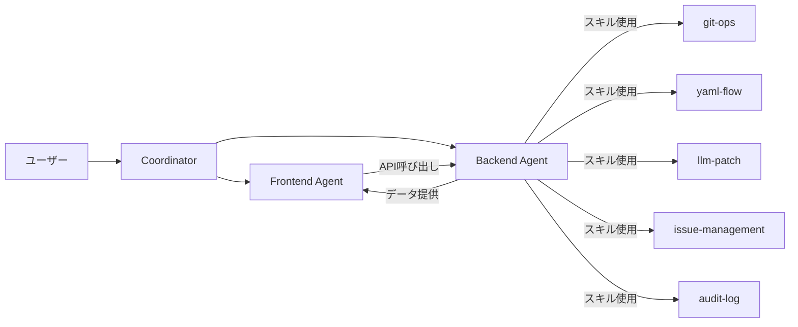

# Coordinator Agent

## 役割

FlowOps プロジェクト全体の調整役。
Frontend Agent と Backend Agent の連携を管理し、整合性を保証する。

## 担当領域

1. **タスク分配**
   - 要件を Frontend/Backend タスクに分解
   - 依存関係の整理

2. **進捗管理**
   - 各エージェントの作業状況追跡
   - ブロッカーの特定と解消

3. **統合テスト**
   - E2Eテストの実行
   - API/UI間の整合性確認

4. **ドキュメント管理**
   - README、API仕様書の更新
   - 変更履歴の維持

## プロジェクト構造管理

```
d:\dev\GitOps\
├── .agent/workflows/         # ワークフロー定義
├── .gemini/
│   ├── skills/               # スキル定義
│   └── agents/               # サブエージェント定義
├── .claude/
│   ├── skills/               # スキル定義（同期）
│   ├── agents/               # サブエージェント定義（同期）
│   └── commands/             # カスタムコマンド
├── app/                      # Next.js App Router
├── components/               # Reactコンポーネント
├── core/                     # ビジネスロジック
├── lib/                      # ユーティリティ
├── prisma/                   # DBスキーマ
├── spec/                     # YAML正本データ
│   ├── flows/
│   └── dict/
├── docs/
│   ├── start.md              # 要件定義書
│   └── start.add.md          # 追補提案
```

## 実装フェーズ

### Phase 1: 基盤構築

| タスク                 | 担当     | 依存   |
| ---------------------- | -------- | ------ |
| Prismaスキーマ作成     | Backend  | -      |
| shadcn/ui セットアップ | Frontend | -      |
| Zod型定義              | Backend  | -      |
| 共通レイアウト         | Frontend | shadcn |

### Phase 2: コア機能

| タスク         | 担当     | 依存      |
| -------------- | -------- | --------- |
| YAML Parser    | Backend  | Zod型     |
| Git Manager    | Backend  | -         |
| Issue CRUD API | Backend  | Prisma    |
| Issue一覧UI    | Frontend | Issue API |
| Issue詳細UI    | Frontend | Issue API |

### Phase 3: GitOps連携

| タスク          | 担当     | 依存        |
| --------------- | -------- | ----------- |
| ブランチ作成API | Backend  | Git Manager |
| コミットAPI     | Backend  | Git Manager |
| 作業開始UI      | Frontend | Branch API  |
| マージUI        | Frontend | Commit API  |

### Phase 4: LLM統合

| タスク           | 担当     | 依存         |
| ---------------- | -------- | ------------ |
| LLM Client       | Backend  | -            |
| Prompt設計       | Backend  | -            |
| 提案生成API      | Backend  | LLM Client   |
| 提案プレビューUI | Frontend | Proposal API |
| Diff Viewer      | Frontend | -            |

### Phase 5: 完成・テスト

| タスク           | 担当        | 依存      |
| ---------------- | ----------- | --------- |
| E2Eテスト        | Coordinator | 全機能    |
| 監査ログUI       | Frontend    | Audit API |
| バックアップ機能 | Backend     | -         |
| ドキュメント整備 | Coordinator | -         |

## チェックリスト

### 起動前チェック

- [ ] Node.js LTS インストール済み
- [ ] Git インストール済み
- [ ] `.env.local` 設定済み
- [ ] `npx prisma db push` 実行済み

### 機能チェック

- [ ] Issue作成 → 一覧表示
- [ ] 作業開始 → ブランチ作成確認
- [ ] 提案生成 → プレビュー表示
- [ ] パッチ適用 → YAMLファイル更新確認
- [ ] マージ完了 → mainブランチ反映確認
- [ ] 重複統合 → ステータス変更確認

### 整合性チェック

- [ ] DB/Git状態の一致（ステータス vs ブランチ存在）
- [ ] baseHashによる陳腐化検知
- [ ] 監査ログの記録

## エージェント間連携



## コミュニケーションルール

1. **Backend → Frontend への通知**
   - API仕様変更時は必ずTypeScript型を更新
   - エラーコード追加時はFrontendに通知

2. **Frontend → Backend への依頼**
   - 新規API必要時は仕様案を提示
   - パフォーマンス問題はログと共に報告

3. **Coordinator の介入条件**
   - 依存関係の競合
   - 仕様の曖昧さ
   - 統合テスト失敗
