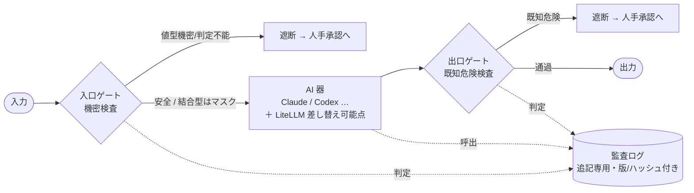
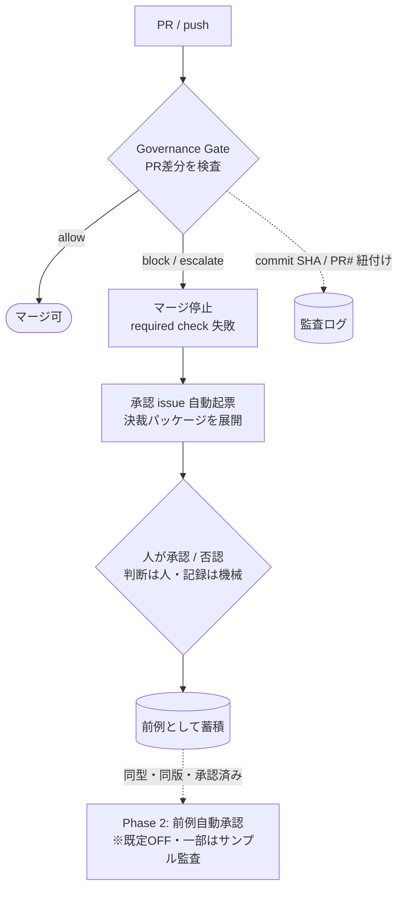
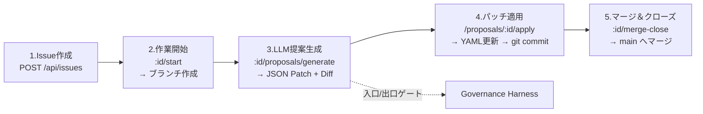

# FlowOps — GitOps for Business ＋ ガバナンス・ハーネス

> **ひとことで言うと**
> 業務フローを「コード（YAML）」として正本管理し、非エンジニアでも理解・指摘・修正提案できるようにする **「GitOps for Business」** プラットフォーム。
> さらに、外部AIエージェント（Claude / Codex 等）の利用を **自社の統治層（ポリシー・決定論ゲート・監査証跡）で包む「ガバナンス・ハーネス」** を備える。

## これは何をするもの？（初見の方へ）

このプロジェクトは、大きく **2つのこと** をします。

1. **業務フローを Git で管理する**
   業務手順を `spec/flows/*.yaml` に「正本（SSOT）」として置き、UI操作を裏で Git（branch / commit / merge）に変換。**誰が・いつ・何を・なぜ変えたか**が履歴に残ります。

2. **AIの利用を「統治」する（ガバナンス・ハーネス）**
   AIに修正案を出させつつ、その入出力を自社のルールで挟みます。
   - **入口ゲート**: AIに渡す前に機密（鍵・個人情報など）を決定論的に検査・遮断
   - **出口ゲート**: AIが出した成果物を独立した検出系で検査（既知の危険を削減）
   - **監査ログ**: すべての判定を改竄不能な追記専用ログに記録（ポリシー版・時刻・ハッシュ付き）
   - **承認ワークフロー**: 判断は人・記録は機械。前例を蓄積し、段階的に自動化

> 設計思想は **「器（AIの実行環境）は借り、統治（ポリシー・ゲート・監査）は自社で持つ」**。
> ベンダーの価格改定や規制強化に揺るがない、模倣困難な自社資産を作ることが狙いです。
> 詳細は [docs/governance/](docs/governance/) を参照。

## 🚀 クイックスタート（5分で試す）

**いちばん簡単（Windows / Docker不要）**: リポジトリ直下の **`start.bat` をダブルクリック**。
初回は `.env`作成→依存インストール→DB作成→初期データ投入→起動→ブラウザ起動まで自動です。

**コマンドで動かす場合**:

```bash
git clone https://github.com/Taguchi-1989/GitOps.git && cd GitOps
npm install
cp .env.example .env
# ↓ .env の DATABASE_URL を SQLite に変更（.env.example の既定は PostgreSQL、schema は SQLite）
#   DATABASE_URL="file:./prisma/dev.db"
# （LLM を試す時だけ LLM_API_KEY も設定）
npx prisma db push                   # SQLite DB を作成
npm run db:seed                      # 初期データ投入
npm run dev                          # → http://localhost:3000
```

> `start.bat` はこの DATABASE_URL（SQLite）を自動生成します。コマンド手順では `.env` の `DATABASE_URL` を必ず `file:` URL にしてください（PostgreSQL のままだと `prisma db push` / `npm run dev` が失敗します）。

- ログイン: `admin@flowops.local` / `admin`
- まず試すこと: ダッシュボード → フロー閲覧（Mermaid図）→ Issue作成 → （LLMキーがあれば）提案生成
- **ガバナンスを体感する**: Issueの説明に「ダミーの鍵」っぽい文字列を入れて提案生成すると、入口ゲートが `422 INGRESS_BLOCKED` で外部送出を止めます

**ガバナンスゲートだけ単体で試す（アプリ不要）**:

```bash
GITHUB_BASE_REF=master GH_PR_NUMBER=1 npm run governance:gate
# PR差分を入口/出口ゲートで検査 → allow なら exit 0 / 機密・危険検出で exit 1（決裁パッケージ出力）
```

## コア・コンセプト

| 原則                              | 説明                                                                                                       |
| --------------------------------- | ---------------------------------------------------------------------------------------------------------- |
| **SSOT (Single Source of Truth)** | 全ての業務フローは `spec/flows/*.yaml` を正本とする。DBはIssue管理用の派生データ                           |
| **GitOps Automation**             | UI操作をGitコマンド（branch, commit, merge）に自動変換。履歴の透明性と復元性を担保                         |
| **LLM-Assisted Proposals**        | Issue報告に基づきLLMがYAML修正案（JSON Patch）を自動生成。Zodスキーマで出力を検証                          |
| **Robust Issue Management**       | 「同じ指摘」が複数来ることを前提に、重複統合（Merge Duplicates）をシステムレベルでサポート                 |
| **Governance Harness**            | AIの入出力を「ポリシー・決定論ゲート・監査証跡」の独立三層で挟む。器（AI）の乗り換えに波及しない純粋な境界 |

## ガバナンス・ハーネス（AI活用の統治層）

AIエージェントの「使い方」ではなく「**統治のしかた**」を自社資産として持つ仕組みです。
三層は **LLM を呼ばない決定論的な純関数** で、器（オーケストレータ）の乗り換えに波及しません。



| 層                   | 役割                                                                                   | 実装                 |
| -------------------- | -------------------------------------------------------------------------------------- | -------------------- |
| **入口ゲート**       | 外部送出前に機密混入を決定論検査。結合型はマスキング、値型/判定不能は遮断（fail-safe） | `src/core/ingress/`  |
| **出口ゲート**       | AI出力を入口と独立した検出系（ルール＋エントロピー）で検査。既知危険を確率的に削減     | `src/core/egress/`   |
| **監査ログ**         | 全判定を改竄不能に記録。コンテンツハッシュ・ポリシー版・重大度層（薄/厚/完全）         | `src/core/audit/`    |
| **承認ワークフロー** | 判断は人・記録は機械。前例を蓄積し、段階的に自動承認（既定はOFF）                      | `src/core/approval/` |
| **GitOps結合**       | 判定を commit SHA / PR番号に紐づけ、PRのマージを制御（required check）                 | `src/core/gitops/`   |

### 使い方

**1) アプリ内（提案生成API）** — 既定で有効。`POST /api/issues/:id/proposals/generate` 実行時に、
入口ゲートが入力を検査（機密検出で `422 INGRESS_BLOCKED`）→ AI生成 → 出口ゲートが成果物を検査
（既知危険で `422 EGRESS_BLOCKED`）。判定はすべて監査ログに残ります。

**2) GitOps（PRゲート）** — `.github/workflows/governance-gate.yml` が PR差分を検査し、
機密混入・既知危険・高リスクで **マージをブロック＋承認issueを自動起票**します。ローカル実行:

```bash
npm run governance:gate     # env(GITHUB_*)からPR文脈を解析しゲート判定（CI/ローカル両用）
```



**3) 前例自動承認（任意・段階導入）** — 既定は無効（Phase 0＝全件人手）。有効化は人間ゲート（PR）で:

```bash
APPROVAL_AUTO_APPROVE=true      # 自動承認を有効化（既定 false）
APPROVAL_AUTO_GRADES=low        # 自動承認を許す リスク等級（まずは low のみ）
APPROVAL_AUTO_SAMPLE_RATE=0.1   # ゴム印化防止のため一部を事後サンプル監査
```

> 詳細・設計判断・残課題は [docs/governance/](docs/governance/) の各ドキュメントを参照（下の「ドキュメント」節にも一覧）。

## アーキテクチャ

```
┌─────────────────────────────────────────────────┐
│  UI Layer (Next.js App Router + React)          │
│  Dashboard / Flow Viewer / Issue Management     │
└─────────────────────┬───────────────────────────┘
                      │  REST API
┌─────────────────────▼───────────────────────────┐
│  Core Logic Layer                               │
│  ┌──────────┐ ┌──────────┐ ┌────────────┐      │
│  │ Parser   │ │ Git Mgr  │ │ LLM Client │      │
│  │ (Zod)    │ │ (Mutex)  │ │ (Multi)    │      │
│  └──────────┘ └──────────┘ └────────────┘      │
│  ┌──────────┐ ┌──────────┐ ┌────────────┐      │
│  │ Patch    │ │ Issue    │ │ Audit Log  │      │
│  │ (RFC6902)│ │ Lifecycle│ │            │      │
│  └──────────┘ └──────────┘ └────────────┘      │
│  ── Governance Harness（統治層） ──────────────  │
│  ┌────────┐ ┌────────┐ ┌────────┐ ┌──────────┐ │
│  │ Ingress│ │ Egress │ │Approval│ │ GitOps   │ │
│  │ Gate   │ │ Gate   │ │(前例)  │ │ Binding  │ │
│  └────────┘ └────────┘ └────────┘ └──────────┘ │
└─────────────────────┬───────────────────────────┘
                      │
┌─────────────────────▼───────────────────────────┐
│  Persistence Layer                              │
│  SQLite (Prisma ORM)  +  Local Git Repository   │
│  Issues/Proposals/Audit   YAML Files (The Truth)│
└─────────────────────────────────────────────────┘
```

## 技術スタック

| カテゴリ           | 技術                                                                          |
| ------------------ | ----------------------------------------------------------------------------- |
| Runtime            | Node.js LTS                                                                   |
| Framework          | Next.js 14 (App Router)                                                       |
| Language           | TypeScript (Strict Mode)                                                      |
| Database           | SQLite（既定・ワンクリック起動） / PostgreSQL（Docker フル構成） + Prisma ORM |
| UI                 | Tailwind CSS + shadcn/ui + Lucide React                                       |
| Flow Visualization | Mermaid.js                                                                    |
| Git                | simple-git (Mutex Lock付き)                                                   |
| LLM                | OpenAI互換API（マルチプロバイダー対応）                                       |
| Validation         | Zod (全入出力境界で使用)                                                      |
| Testing            | Vitest                                                                        |

## Windows ワンクリック起動（最も簡単 / Docker不要）

**前提条件**: Node.js >= 18 だけ（Docker も Git も不要）

リポジトリ直下の **`start.bat` をダブルクリック** するだけです。初回は自動で
`.env` 作成 → 依存インストール → SQLite データベース作成 → 初期データ投入 →
開発サーバー起動 → ブラウザを開く、まで一気に行います。

- DB は **SQLite**（`prisma/dev.db`）。Docker や PostgreSQL は不要です。
- ログイン: `admin@flowops.local` / `admin`
- 停止: 起動ウィンドウを閉じる（または `Ctrl+C`）
- LLM を使う機能を試す場合のみ、生成された `.env` の `LLM_API_KEY` を実際のキーに書き換えてください。

> なぜ SQLite か: 別PCでも前提ソフトを増やさず確実に動かすためです。`.env` と
> `prisma/dev.db` は git 管理外なので、clone 直後の他PCでは `start.bat` が
> それらを自動生成します。

## 手動ローカル起動（SQLite）

```bash
# 1. セットアップ
npm install
cp .env.example .env           # DATABASE_URL を file:./prisma/dev.db に設定
npx prisma db push             # SQLite DB を作成
npm run db:seed                # 初期データ投入

# 2. 起動
npm run dev
# → http://localhost:3000
```

> ⚠ 現在の `prisma/schema.prisma` は `provider = "sqlite"` です。`DATABASE_URL` は
> `file:./prisma/dev.db` のような `file:` URL を指定してください
> （`postgresql://...` を指定すると Prisma がエラーになります）。
> PostgreSQL を使うフルスタック構成は次節を参照。

## Docker起動（フルスタック）

LiteLLM（LLMゲートウェイ）+ Langfuse（LLMOps）を含む完全構成:

```bash
cp .env.example .env
# .env で OPENAI_API_KEY 等を設定

docker compose up -d
# → FlowOps:  http://localhost:3000
# → Langfuse:  http://localhost:3001
# → LiteLLM:   http://localhost:4000
```

### 環境変数

| 変数             | 必須 | 説明                                                  |
| ---------------- | ---- | ----------------------------------------------------- |
| `DATABASE_URL`   | Yes  | SQLiteパス（デフォルト: `file:./dev.db`）             |
| `LLM_PROVIDER`   | No   | プロバイダー名（デフォルト: `openai`）                |
| `LLM_API_KEY`    | Yes  | APIキー（全プロバイダー共通）                         |
| `LLM_MODEL`      | No   | モデル名（省略時はプロバイダーのデフォルト）          |
| `LLM_BASE_URL`   | No   | カスタムベースURL（プロバイダーデフォルトを上書き）   |
| `LLM_JSON_MODE`  | No   | JSON modeサポート（`true`/`false`, プロバイダー依存） |
| `OPENAI_API_KEY` | -    | 後方互換（`LLM_API_KEY`未設定時のフォールバック）     |
| `OPENAI_MODEL`   | -    | 後方互換（`LLM_MODEL`未設定時のフォールバック）       |

### スクリプト

```bash
npm run dev          # 開発サーバー起動
npm run build        # プロダクションビルド
npm run test         # テスト実行 (Vitest)
npm run test:watch   # テスト監視モード
npm run test:coverage # カバレッジ付きテスト
npm run typecheck    # TypeScript型チェック
npm run lint         # ESLint
npm run format       # Prettier整形
npm run db:push      # Prismaスキーマ同期
npm run db:studio    # Prisma Studio (DB GUI)
npm run governance:gate # ガバナンス・ハーネス: PR差分をゲート判定（CI/ローカル両用）
```

## GitOps ワークフロー

FlowOpsの中心となる操作サイクル:



> 提案生成（手順3）の前後に入口ゲート・出口ゲートが挟まり、機密や既知危険を検出すると `422` で止まります。

**鉄則**: DB状態の更新は、Git commitが成功した後にのみ実行される。

## データモデル

```
Issue (ISS-001形式)
├── status: new → triage → in-progress → proposed → merged / rejected
├── targetFlowId: 対象YAMLフロー
├── branchName: Git作業ブランチ
├── canonicalId: 重複統合先（Duplicateチェーン）
├── proposals[]: LLM生成パッチ（baseHash付き陳腐化検知）
└── evidences[]: スクリーンショット/リンク/ログ

Proposal
├── intent: 変更意図の要約
├── jsonPatch: RFC 6902 JSON Patch
├── diffPreview: HTML差分表示
└── baseHash: 生成時点のYAMLハッシュ（Stale検知用）

AuditLog （追記専用 / append-only）
├── actor / action / entityType / entityId / payload
├── contentHash: payloadの決定論ハッシュ（重複排除・実体非保持）
├── policyVersion / policyHash: 判定時のポリシー版（後から再現可能）
├── severity: 重大度層（thin=通過 / thick=要エスカレ / full=インシデント）
└── 全操作・全ゲート判定の "誰が/いつ/何を/なぜ" を追跡
```

> ガバナンスゲートの判定（`INGRESS_GATE` / `EGRESS_GATE` / `GITOPS_GATE` / `AUTO_APPROVE` /
> `PRECEDENT_RECORD`）もこの監査ログに残ります。提案生成APIは機密検出で `422 INGRESS_BLOCKED`、
> 危険出力検出で `422 EGRESS_BLOCKED` を返します。

## YAML フロー定義

`spec/flows/*.yaml` が業務フローのSSOT。`nodes`と`edges`はRecord構造（配列ではない）で、JSON Patchの安定性を確保。

```yaml
id: order-process
title: 受注処理フロー
layer: L1 # L0=戦略, L1=業務プロセス, L2=システム手順
updatedAt: '2026-02-05T00:00:00Z'

nodes:
  start_node:
    id: start_node
    type: start # start / end / process / decision / database
    label: 受注開始
  receive_order:
    id: receive_order
    type: process
    label: 受注受付
    role: 営業 # spec/dictionary/roles.yaml で定義
    system: CRM # spec/dictionary/systems.yaml で定義

edges:
  e1:
    id: e1
    from: start_node
    to: receive_order
```

**バリデーション (Zod + 参照整合性)**:

- Zodスキーマによる構造・型検証
- `edges[*].from/to` が nodes に存在するか
- start/end ノードの存在確認
- 孤立ノード・到達不能パスの警告

## API エンドポイント

| Method           | Path                                 | 説明                     |
| ---------------- | ------------------------------------ | ------------------------ |
| GET              | `/api/flows`                         | フロー一覧               |
| GET              | `/api/flows/:id`                     | フロー詳細 + Mermaid図   |
| GET/POST         | `/api/issues`                        | Issue一覧 / 作成         |
| GET/PATCH/DELETE | `/api/issues/:id`                    | Issue詳細 / 更新 / 削除  |
| POST             | `/api/issues/:id/start`              | 作業開始（ブランチ作成） |
| POST             | `/api/issues/:id/proposals/generate` | LLM提案生成              |
| POST             | `/api/proposals/:id/apply`           | パッチ適用               |
| POST             | `/api/issues/:id/merge-close`        | マージ＆クローズ         |
| POST             | `/api/issues/:id/merge-duplicate`    | 重複統合                 |
| GET              | `/api/audit`                         | 監査ログ照会             |
| GET              | `/api/health`                        | ヘルスチェック           |

全レスポンスは `{ ok: boolean, data?, errorCode?, details? }` の統一形式。

## ディレクトリ構造

```
src/
├── app/                          # Next.js App Router
│   ├── api/                      # 全APIルート
│   ├── flows/                    # フロー閲覧ページ
│   ├── issues/                   # Issue管理ページ
│   ├── error.tsx                 # グローバルError Boundary
│   └── page.tsx                  # ダッシュボード
├── components/
│   ├── flow/                     # FlowViewer, MermaidViewer
│   ├── issue/                    # IssueList, IssueDetail, ProposalCard
│   └── ui/                       # MainLayout, Toast, StatusBadge, Spinner
├── core/                         # フレームワーク非依存のビジネスロジック
│   ├── git/manager.ts            # SimpleGitラッパー（Mutex Lock付き）
│   ├── git/lock.ts               # Repo排他制御（タイムアウト30s, 自動解除60s）
│   ├── parser/schema.ts          # Zod: Flow/Node/Edge/Layer型定義
│   ├── parser/validateFlow.ts    # 参照整合性チェック
│   ├── parser/toMermaid.ts       # Flow → Mermaid変換
│   ├── patch/apply.ts            # RFC 6902 JSON Patch適用
│   ├── patch/diff.ts             # Flow差分計算 + HTML出力
│   ├── patch/hash.ts             # SHA256 (baseHash, 陳腐化検知)
│   ├── llm/client.ts             # マルチプロバイダーLLMクライアント（リトライ, 出力検証）
│   ├── llm/prompts.ts            # プロンプトテンプレート + 禁止事項
│   ├── issue/humanId.ts          # ISS-001形式ID生成
│   ├── issue/duplicate.ts        # 重複統合ロジック（状態遷移検証）
│   ├── audit/logger.ts           # 監査ログ記録
│   ├── audit/hash.ts             # コンテンツアドレス（決定論ハッシュ, LOG-1/2）
│   ├── ingress/                  # 入口ゲート（機密混入検査 / 決定論 / fail-safe）
│   ├── egress/                   # 出口ゲート（独立検出系: ルール＋エントロピー）
│   ├── approval/                 # 承認ワークフロー（前例蓄積 / 自動承認 / サンプル監査）
│   ├── gitops/                   # GitOps結合アダプタ（GitHub SDK非依存 / 移植性）
│   └── types/api.ts              # API統一レスポンス型
└── lib/
    ├── prisma.ts                 # Prismaクライアント
    ├── flow-service.ts           # YAML I/O + 辞書読み込み
    ├── api-utils.ts              # レスポンスヘルパー + sanitizeFlowId
    ├── audit-repository.ts       # 監査ログPrismaリポジトリ
    └── bootstrap.ts              # アプリ初期化

spec/
├── flows/                        # YAML正本 (SSOT)
│   ├── order-process.yaml        # 受注処理フロー (L1)
│   ├── inquiry-handling.yaml     # 問い合わせ対応フロー (L1)
│   └── shipping-process.yaml     # 出荷処理フロー (L1)
├── dictionary/
│   ├── roles.yaml                # 役割定義 (営業, 倉庫, 購買, etc.)
│   └── systems.yaml              # システム定義 (CRM, WMS, ERP, etc.)
└── gates/                        # 決定論ゲートのポリシー（宣言的YAML）
    ├── ingress-secret-gate.yaml  # 入口ゲートの機密検出パターン
    └── safety-review-gate.yaml   # 安全レビュー受入ゲート (ISO 12100)

prisma/
├── schema.prisma                 # Issue, Proposal, Evidence, AuditLog
└── dev.db                        # SQLiteデータベース

scripts/governance-gate.ts        # ガバナンスゲートCLI（GitHub Actionsから呼ぶ結線）
.github/workflows/governance-gate.yml  # PR required check（block時マージ停止+承認issue起票）
```

## セキュリティ

- **パストラバーサル対策**: flowIdは英数字・ハイフン・アンダースコアのみ許可
- **LLM入力制限**: spec/flows と spec/dict の内容のみLLMに渡す。`.env`やパス情報は渡さない
- **LLM出力検証**: Zodスキーマ + 禁止パス検出(`/id`変更不可) + role/system辞書チェック
- **Git排他制御**: Repo操作はMutex Lockで保護。タイムアウト付き自動解除
- **DB整合性ルール**: Git commit成功後にのみDB状態を変更（不整合防止）

## テスト

```bash
npm run test           # 全テスト実行
npm run test:coverage  # カバレッジレポート
```

| テスト対象             | 内容                                         |
| ---------------------- | -------------------------------------------- |
| `core/parser`          | Zodスキーマ検証（有効/無効フロー, レイヤー） |
| `core/patch/apply`     | JSON Patch適用, stale hash検出, 禁止パス     |
| `core/patch/hash`      | SHA256一貫性, hashMatch比較                  |
| `core/issue/humanId`   | ISS-001形式生成, ブランチ名, スラグ          |
| `core/issue/duplicate` | 重複統合の状態遷移検証                       |
| `core/git/lock`        | Mutex取得/解放, タイムアウト                 |
| `lib/flow-service`     | sanitizeFlowId（パストラバーサル拒否）       |

## LLM プロバイダー設定

OpenAI互換APIを使用し、複数のLLMプロバイダーに対応。`LLM_PROVIDER`環境変数で切り替え可能。

### 対応プロバイダー一覧

| プロバイダー      | `LLM_PROVIDER` | デフォルトモデル          | JSON Mode | ベースURL                                                 |
| ----------------- | -------------- | ------------------------- | --------- | --------------------------------------------------------- |
| OpenAI            | `openai`       | `gpt-4o`                  | Yes       | `https://api.openai.com/v1`                               |
| Anthropic         | `anthropic`    | `claude-sonnet-4-6`       | No        | `https://api.anthropic.com/v1`                            |
| Google Gemini     | `gemini`       | `gemini-3-flash`          | Yes       | `https://generativelanguage.googleapis.com/v1beta/openai` |
| Groq              | `groq`         | `llama-3.3-70b-versatile` | Yes       | `https://api.groq.com/openai/v1`                          |
| Ollama (ローカル) | `ollama`       | `llama3.2`                | Yes       | `http://localhost:11434/v1`                               |
| カスタム          | `custom`       | -                         | 要設定    | `LLM_BASE_URL`で指定                                      |

### プロバイダー別 .env.local 設定例

#### OpenAI

```bash
LLM_PROVIDER=openai
LLM_API_KEY=sk-xxxxxxxxxxxxxxxx
# LLM_MODEL=gpt-4o  (デフォルト)
```

#### Anthropic (Claude)

```bash
LLM_PROVIDER=anthropic
LLM_API_KEY=sk-ant-xxxxxxxxxxxxxxxx
# LLM_MODEL=claude-sonnet-4-6  (デフォルト)
# JSON mode非対応のため、レスポンスからJSON部分を自動抽出
```

#### Google Gemini

```bash
LLM_PROVIDER=gemini
LLM_API_KEY=AIzaxxxxxxxxxxxxxxxxx
# LLM_MODEL=gemini-3-flash  (デフォルト)
```

#### Groq

```bash
LLM_PROVIDER=groq
LLM_API_KEY=gsk_xxxxxxxxxxxxxxxx
# LLM_MODEL=llama-3.3-70b-versatile  (デフォルト)
```

#### Ollama (ローカルLLM)

```bash
LLM_PROVIDER=ollama
LLM_API_KEY=ollama  # Ollamaではダミー値でOK
# LLM_MODEL=llama3.2  (デフォルト)
```

#### カスタムOpenAI互換サーバー

```bash
LLM_PROVIDER=custom
LLM_API_KEY=your-api-key
LLM_BASE_URL=https://your-server.example.com/v1
LLM_MODEL=your-model-name
LLM_JSON_MODE=true
```

### JSON Mode非対応プロバイダーの扱い

JSON Modeをサポートしないプロバイダー（Anthropic等）の場合、LLMの応答から以下の順序でJSONを自動抽出します:

1. レスポンス全体をそのまま `JSON.parse()`
2. ` ```json ... ``` ` コードブロックから抽出
3. 最初の `{ ... }` ブロックを抽出

これにより、プロバイダーを問わず安定した動作を実現しています。

## エージェント/スキル

`.claude/skills/` と `.claude/agents/` にAIエージェント用のスキル定義:

| スキル             | 説明                                        |
| ------------------ | ------------------------------------------- |
| `git-ops`          | Git操作の自動化とリポジトリ管理             |
| `issue-management` | Issue/Proposal/Evidenceのライフサイクル管理 |
| `llm-patch`        | LLMを活用したパッチ生成と適用               |
| `yaml-flow`        | YAMLフロー定義の解析・検証・変換            |
| `audit-log`        | 監査ログの記録・照会                        |

## ドキュメント

| ファイル                           | 内容                                                 |
| ---------------------------------- | ---------------------------------------------------- |
| `docs/improvement-backlog-pdca.md` | **改善バックログ兼 PDCA 運用計画（改善の単一入口）** |
| `docs/start.md`                    | システム要件定義書 v1.0                              |
| `docs/start.add.md`                | レビュー追補提案（非機能要件, セキュリティ, 監査等） |
| `CLAUDE.md`                        | AI Agent用のプロジェクトコンテキスト                 |

### ガバナンス・ハーネス関連

| ファイル                                              | 内容                                                       |
| ----------------------------------------------------- | ---------------------------------------------------------- |
| `docs/governance/integration-to-flowops.md`           | **統合設計・ロードマップ（全体像はまずここ）**             |
| `docs/governance/governance-harness-proposal-v0.1.md` | 経営層向け提案（なぜやるか）                               |
| `docs/governance/governance-harness-spec-v0.1.md`     | 技術要件定義書（実装契約）                                 |
| `docs/governance/audit-append-only.md`                | 監査ログの追記専用化（LOG-3）                              |
| `docs/governance/swappable-point-b.md`                | 差し替え可能点B（LiteLLM/プロバイダ切替）                  |
| `docs/governance/egress-gate.md`                      | 出口ゲート（独立検出系・ゼロデイ非担保の明示）             |
| `docs/governance/approval-phase0.md`                  | 承認 Phase 0（前例蓄積）                                   |
| `docs/governance/auto-approval-phase2.md`             | 前例自動承認＋サンプル監査（多重fail-safe）                |
| `docs/governance/gitops-binding.md`                   | 第II部 GitOps結合（GIT-1〜4）                              |
| `docs/aims/`                                          | ISO/IEC 42001 AIMS（AIマネジメントシステム）ガバナンス文書 |

## License

MIT
