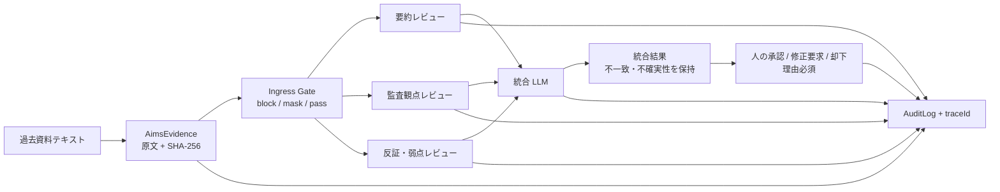

# AIMS 過去資料レビュー — 原文正本・複数 LLM・人判断

過去の議事録、インシデント記録、監査メモ、運用ログなどをテキストで取り込み、複数の LLM 観点でレビューする機能の運用仕様です。

この機能はレビュー準備を支援します。LLM 出力は、適合証明、認証判断、法的判断、内部監査人の最終結論ではありません。最終判断は、理由を記録した権限者が行います。

## 設計原則

1. 取り込んだ原文を正本とし、正規化後の SHA-256 を固定する。
2. 原文、モデル別出力、統合出力、人の判断を別レコードで保存する。
3. 各モデルについて provider、model、role、promptVersion、入力/出力ハッシュ、所要時間、状態を記録する。
4. モデルは独立にレビューし、統合モデルは不一致を消さずに整理する。
5. 外部送信前に Ingress Gate、出力保存前に Egress Gate を通す。
6. 監査ログには原文や API キーを載せず、ハッシュ、モデル識別子、判定状態だけを載せる。
7. LLM の多数決を真実と見なさず、すべての統合結果を人判断待ちにする。

ISO/IEC 42001 は、AIMS を方針・目的・プロセスを含む継続的なマネジメントシステムとして位置づけています。したがって、単発の LLM 要約だけでは AIMS にはならず、責任、リスク処置、評価、改善へ接続する必要があります。参考: [ISO/IEC 42001:2023 公式概要](https://www.iso.org/standard/42001)。

また、NIST AI RMF Core は、文書化が透明性、人のレビュー、説明責任を支え、人と AI の役割・監督を定義することを示しています。参考: [NIST AI RMF Core](https://airc.nist.gov/airmf-resources/airmf/5-sec-core/)。

## データフロー



## 既定動作

`AIMS_LLM_REVIEWERS` を設定しない場合、通常の `LLM_PROVIDER` / `LLM_MODEL` を使い、次の4つの論理ロールを実行します。

| ID                  | ロール      | 目的                                           |
| ------------------- | ----------- | ---------------------------------------------- |
| `default-summary`   | summarizer  | 事実、決定、日時、関係者、不足情報の忠実な要約 |
| `default-audit`     | auditor     | 管理策、ギャップ、リスク、追加証拠の候補       |
| `default-challenge` | challenger  | 仮定、矛盾、別解釈、過信の検出                 |
| `default-synthesis` | synthesizer | 3結果の比較、不一致と不確実性を保持した統合    |

既定値は同じ provider/model に複数の観点を与える構成で、モデル多様性はありません。相関した誤りを減らしたい場合は、下記のように異なる provider/model を明示します。複数モデルでも、独立した人の監査の代替にはなりません。

## 複数モデル設定

API キーそのものは JSON に書かず、環境変数名だけを `apiKeyEnv` で指定します。

```json
[
  {
    "id": "summary-openai",
    "role": "summarizer",
    "provider": "openai",
    "model": "your-approved-model",
    "apiKeyEnv": "OPENAI_API_KEY"
  },
  {
    "id": "audit-anthropic",
    "role": "auditor",
    "provider": "anthropic",
    "model": "your-approved-model",
    "apiKeyEnv": "ANTHROPIC_API_KEY"
  },
  {
    "id": "challenge-local",
    "role": "challenger",
    "provider": "ollama",
    "model": "your-local-model",
    "baseURL": "http://localhost:11434/v1"
  },
  {
    "id": "synthesis-gemini",
    "role": "synthesizer",
    "provider": "gemini",
    "model": "your-approved-model",
    "apiKeyEnv": "GEMINI_API_KEY"
  }
]
```

これを改行なしの JSON として `.env` の `AIMS_LLM_REVIEWERS` に設定します。最大1つの synthesizer と、最低1つの独立レビュー担当が必要です。リクエストの `reviewerIds` で独立レビュー担当だけを絞り込めます。

## 長文の扱いとコスト

原文は行番号を付けた決定論的チャンクへ分割します。モデルの `evidenceRefs` は `[L12-L18]` のように原文へ戻れます。

| 環境変数                  |    既定 | 意味                          |
| ------------------------- | ------: | ----------------------------- |
| `AIMS_REVIEW_CHUNK_CHARS` | `16000` | 1チャンクの最大文字数         |
| `AIMS_MAX_REVIEW_CHUNKS`  |     `6` | 1レビュー実行の最大チャンク数 |

最大呼出数の目安は `独立レビュー数 × チャンク数 + 統合1回` です。既定構成の上限は19回です。取り込み自体は50万文字まで受け付けますが、レビュー上限を超える場合は資料を論理単位に分割するか、コストとモデルコンテキストを評価して上限を変更します。

## API 利用例

### 1. 過去資料を取り込む

```http
POST /api/aims/evidence
Content-Type: application/json

{
  "title": "2025年 第4四半期 AI運用レビュー議事録",
  "sourceText": "ここに正本となる過去テキストを入れる",
  "sourceType": "meeting-minutes",
  "sourceLabel": "legacy-share/review-2025Q4.txt",
  "sensitivityLevel": "L2",
  "tags": ["operations", "quarterly-review"],
  "metadata": { "department": "AI governance" }
}
```

### 2. 複数 LLM レビューを実行する

```http
POST /api/aims/evidence/{evidenceId}/reviews
Content-Type: application/json

{
  "objective": "AIMSの運用証拠、未処置リスク、追加確認事項を整理する",
  "reviewerIds": ["summary-openai", "audit-anthropic", "challenge-local"]
}
```

モデルの一部が失敗した場合、成功結果を保持して run は `partial` になります。統合モデルだけが失敗した場合は、成功したレビューを決定論的に結合し `partial` として返します。全独立レビューが失敗した場合は run を `failed` にします。

### 3. 結果を取得する

```http
GET /api/aims/reviews/{runId}
```

統合出力 `aims-review.v1` は、要約だけでなく、主張、管理策評価、リスク、所見、不確実性、モデル間不一致、推奨アクション、拡張項目を持ちます。

### 4. 人の判断を記録する

```http
POST /api/aims/reviews/{runId}/decision
Content-Type: application/json

{
  "decision": "revise",
  "reason": "F-2の根拠行が不足しているため、原資料を追加して再レビューする"
}
```

`decision` は `approved` / `revise` / `rejected` のいずれかです。理由は必須で、一度記録した判断は上書きしません。追加資料や判断変更は新しい review run として残します。

## 保証境界と運用上の注意

- 原文は SQLite に保存されます。DBファイルのアクセス制御、暗号化、バックアップ、保持期間は組織の情報分類に合わせて別途定義します。
- 外部 LLM へ送れる情報分類、プロバイダの保持・学習利用条件、リージョン、契約上の責任分界を承認してから利用します。
- `mask` 判定時、外部モデルが見るテキストと正本は異なります。正本ハッシュとゲート判定を確認して解釈します。
- モデルの provider/model/prompt を変えた結果は再現性が異なります。過去 run を上書きせず、新しい run と比較します。
- `extensions` は業界固有項目を追加する場所です。AIMS の必須記録を `extensions` だけに隠さず、管理文書と SoA に反映します。
- 本機能の導入だけで ISO/IEC 42001 適合や認証を主張しません。AIMS のスコープ、組織の責任、力量、内部監査、マネジメントレビュー、是正・継続改善を含む運用証拠が別途必要です。
