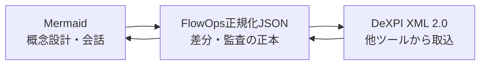
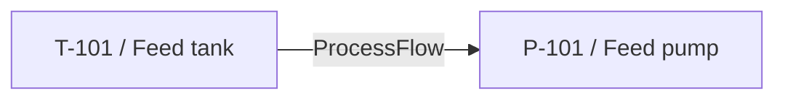

# DeXPI 2.0 交換機能

FlowOpsでは、P&ID等のプロセス産業データを次の三層に分けます。

- **正本:** `flowops-dexpi.v1` JSON。ObjectをIDで平坦化し、data、composition、referenceを明示します。
- **設計ビュー:** Mermaid。設備や接続を短い記法で反復編集できます。
- **交換境界:** DeXPI XML 2.0。`Model`、`Import`、`Object`、`Data`、`Components`、`References`を読み書きします。

DeXPI 2.0は2025年10月に公開され、従来のProteus Schemaに代わる標準シリアライズとしてDEXPI XMLを採用しました。P&IDのPlant Modelは1.4の内容との後方互換性を維持しています。仕様の正本とXML Schemaは、[DEXPI公式仕様ページ](https://dexpi.org/specifications/)および[DEXPI Specification 2.0](https://dexpi.gitlab.io/-/Specification/-/jobs/11676485644/artifacts/src/.build/html/html/index.html)を参照してください。

## 使い方

アプリの `/dexpi` を開きます。

1. Mermaid、正規化JSON、DeXPI XML 2.0のいずれかを貼り付けるか、ファイルを選びます。
2. 「JSON正本へ変換・検証」を実行します。
3. MermaidビューとJSONを確認します。
4. JSON、Mermaid、DeXPI XMLをダウンロードします。
5. 変換結果を入力欄へ戻して反復編集できます。

APIは次の2つです。

- `POST /api/dexpi/import`: `format` (`json` / `mermaid` / `dexpi-xml`) と `content` を受け取ります。
- `POST /api/dexpi/export`: `format` と正規化済み `document` を受け取ります。

いずれも5 MBを上限とし、XMLのDTD・外部実体を拒否します。import/exportの実行は内容そのものを監査ログへ残さず、モデルURI、形式、件数だけを記録します。

## Mermaid注釈

通常のflowchartにDeXPI注釈コメントを加えられます。

対応するクラスは `pump`、`tank`、`valve`、`piping`、`instrumentation` です。`dexpi:type` があればそちらを優先します。型指定がないノードはローカル拡張 `/FlowOpsGenericPlantItem` になります。

Mermaidの辺は、FlowOpsが定義する `FlowOpsConnectivity` ClassExtensionの `FlowTo` 参照へ変換します。これは概念設計を失わずDeXPI XMLへ運ぶためのブリッジです。

## 検証する内容

- JSONスキーマとDeXPI ID/name文字規則
- root、composition対象、内部ID参照の存在
- compositionの単一所有と循環禁止
- rootから到達不能なObjectの禁止
- XML 1.0で使用できない制御文字
- DeXPI import prefixの未宣言警告
- Mermaid由来モデルの概念設計プロファイル警告

## 対応範囲と限界

現段階は、DeXPI XML 2.0の**構造的な取込・往復変換**と、Mermaidによる**概念接続の作成**を対象にします。

次は自動で「詳細設計済み」にはなりません。

- PipingNetworkSystem / Segment / Connection / Nodeによる完全な配管トポロジー
- ノズル、継手、弁、計装ループのクラス別必須プロパティ充足
- Diagramの座標、形状カタログ、P&ID図形の完全再現
- RDL参照と全DeXPIクラス制約の意味検証
- CAEベンダー固有拡張の完全保持

したがってMermaid変換結果は、エンジニアがJSONを補完し、公式XML SchemaとDeXPI/PIDMIC等の検証手段で確認してから詳細設計や受渡しに利用します。DeXPI 1.4のProteus XML (`PlantModel` root) は自動変換せず、識別可能なエラーを返します。旧形式を無言で2.0扱いしないことで、意味の欠落を防ぎます。

## 今後の拡張順

1. DeXPI 2.0 XSDをCIへ固定し、XML Schema検証を追加する。
2. Mermaidの辺をPipingNetworkSystem / Segment / Connectionへ展開するマッピングプロファイルを追加する。
3. Pump、Tank、Valve、Instrumentationの必須・推奨属性テンプレートを追加する。
4. Diagram座標とShapeCatalogueの保持・描画へ拡張する。
5. 代表的なCAEツールとのgolden file往復試験を追加する。
