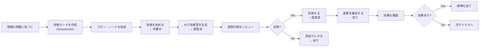

# FlowOps PDCA Personas and E2E Test Design

## Purpose

This document defines the target users, their motivations, expected behavior, and E2E-testable scenarios for making FlowOps usable by non-engineering field teams who need to run continuous improvement cycles.

The product goal is not "users can operate Git." The product goal is:

> A field user can turn a daily problem into an improvement card, review an AI-assisted proposal, confirm the result, and standardize the improved workflow with a visible history.

---

## Product Vocabulary (verified 2026-05-24)

実際のUIテキストを以下に記録する。テストのアサーション候補はここから引用すること。

| Action / concept | Actual UI label (simple mode) | Actual UI label (tech mode) |
| --- | --- | --- |
| Create improvement card | h1: "改善カードを作る"、送信: "改善カードを作成" | 同左 |
| Status: new/triage | "📋 Plan中" | 同左 |
| Status: in-progress | "▶️ Do中" | 同左 |
| Status: proposed | "✨ 改善案あり" | 同左 |
| Status: merged | "🔍 Check待ち" | 同左 |
| Status: rejected | 見送り済 | このIssueは却下されました |
| Start work button | "作業を開始（Do フェーズへ）" | 同左（subtitle: "ブランチを作成"） |
| AI generate button | "AIに改善案を考えてもらう" | 同左（subtitle: "LLMが変更を提案"） |
| Apply proposal button | "反映する" | "適用する"（subtitle: "ブランチにコミット"） |
| Merge/complete button | "フローに反映して Check へ" | "フローに反映 → Check フェーズへ"（subtitle: "ブランチをメインに統合"） |
| Success toast: create | "改善カード ISS-XXX を作成しました" | 同左 |
| Success toast: start | "改善の作業を開始しました" | 同左 |
| Success toast: AI generate | "AIが改善案を作成しました" | 同左 |
| Success toast: apply | "改善案を反映しました" | 同左 |
| Success toast: merge | "変更を確定しました" | 同左 |
| Merge dialog bullet 2 | "この課題は「Check待ち」フェーズに移行します" | 同左 |
| JSON Patch detail | 非表示（折りたたみ） | "変更内容（技術詳細）を表示" |

---

## Available Flows (as of 2026-05-24)

| Flow ID | Title | Key Nodes |
| --- | --- | --- |
| `order-process` | 受注処理フロー | `receive_order`（受注受付）, `check_stock`（在庫確認）, `process_order`（受注処理）, `notify_customer`（顧客通知） |
| `shipping-process` | 出荷処理フロー | — |
| `inquiry-handling` | 問い合わせ対応フロー | — |
| `ai-inquiry-handling` | AI対応問い合わせフロー | — |
| `mechanical-design-process` | 機械設計プロセス | — |
| `mechanical-design-detail` | 機械設計詳細フロー | — |
| `risk-assessment` | リスク評価フロー | — |
| `risk-assessment-detail` | リスク評価詳細フロー | — |

---

## Status Definitions

| Status value | UI badge label | Phase | Meaning |
| --- | --- | --- | --- |
| `new` | "📋 Plan中" | Plan | Submitted, not yet triaged |
| `triage` | "📋 Plan中" | Plan | Under review (same badge as new) |
| `in-progress` | "▶️ Do中" | Do | Improvement branch created |
| `proposed` | "✨ 改善案あり" | Do | AI proposal generated |
| `merged` | "🔍 Check待ち" | Check | Proposal applied and flow updated |
| `rejected` | "見送り済" | — | Deferred or declined |
| `merged-duplicate` | "重複として統合済" | — | Resolved as duplicate |

---

## Primary Personas

### Persona 1: 田中 恵子 — 製造現場 チームリーダー

| Attribute | Detail |
| --- | --- |
| 氏名 | 田中 恵子（42歳） |
| 所属 | 部品製造ライン 組立チーム |
| 技術レベル | 社内システム（在庫・受注）は日常的に使用。GitやYAMLは知らない。 |
| 主な目的 | 繰り返し起きる現場の問題を記録し、具体的な改善につなげる |
| 動機 | 口頭伝達の漏れ、やり直し作業、確認待ち時間を減らしたい |
| 摩擦点 | 仕様書を書いたり、技術的な実装を説明したりしたくない |
| 成功のサイン | 「問題を報告して、提案を確認したら、新しい手順が標準になっていた」 |

**典型的な行動パターン:**

1. 作業中に繰り返し起きる問題に気づく（例：受注登録後に在庫確認が漏れる）
2. FlowOpsを開き、改善カードを新規作成する
3. タイトルと説明を書き込む（技術的な用語は使わない）
4. 「受注処理フロー」を選択し、ダイアグラムから「在庫確認」ノードをクリックして指定する
5. 「Issueを作成」→ 詳細画面に遷移することを確認する
6. 「改善を始める」をクリックしてステータスが「作業中」に変わることを確認する
7. 「AIで改善案を生成」をクリックして提案を待つ
8. 提案の内容を平易な言葉で読み、現場と合っているか判断する
9. 合っていれば「反映する」をクリックして確認ダイアログに応答する
10. 最後に「変更を確定する」を選択して完了を確認する

---

### Persona 2: 佐藤 健一 — 品質管理・改善推進担当

| Attribute | Detail |
| --- | --- |
| 氏名 | 佐藤 健一（35歳） |
| 所属 | 品質保証部 改善推進グループ |
| 技術レベル | KPIやエクセル管理に慣れている。Gitは知らないが構造化された記録は得意。 |
| 主な目的 | PDCA状況の全体把握、エビデンス管理、標準化の追跡 |
| 動機 | 改善が会議やチャットで消えていく状況を防ぎたい |
| 摩擦点 | 完了だけでなく効果測定と再発防止の追跡が必要 |
| 成功のサイン | 「どの改善が対応待ちか、提案レビュー中か、効果確認中かが一目でわかる」 |

**典型的な行動パターン:**

1. ダッシュボード（`/`）にアクセスし、統計カードで状況を把握する
2. 「未対応の課題」「作業中」「改善案あり」の件数をそれぞれ確認する
3. 「改善案あり」のカードをクリックして一覧に遷移する（`/issues?status=proposed`）
4. 各カードの内容・対象フロー・提案内容を確認し、優先度を判断する
5. 履歴タブを開いて操作の時系列記録を確認する
6. 効果が不明なカードに対して次のアクションを検討する
7. ダッシュボードの「最近の課題」で動きのないカードを特定する

---

### Persona 3: 山田 部長 — 承認者・マネージャー

| Attribute | Detail |
| --- | --- |
| 氏名 | 山田 誠（52歳） |
| 所属 | 製造部 部長 |
| 技術レベル | 経営指標・サマリー資料に慣れている。技術的な詳細は不要。 |
| 主な目的 | どの改善を採用するか意思決定する |
| 動機 | 業務リスクを抑えながら現場パフォーマンスを改善したい |
| 摩擦点 | JSONパッチや差分が意思決定の主材料になるのは困る |
| 成功のサイン | 「問題・提案・影響・履歴が明確で、承認の根拠がわかる」 |

**典型的な行動パターン:**

1. 「提案済」ステータスの改善カードを開く（`/issues/[id]`）
2. タイトルと説明で「現状の問題」「期待する改善後の状態」を読む
3. 提案の概要を平易な言葉で確認する（技術詳細は展開しない）
4. 「変更を確定する」ダイアログで "改善内容が正式なフローに反映されます" の説明を読む
5. 承認して完了、または「見送りにする」を選択して理由を残す
6. 履歴タブで誰が何をしたかを確認する

---

### Persona 4: 鈴木 太郎 — システムオーナー / アプリケーションエンジニア

| Attribute | Detail |
| --- | --- |
| 氏名 | 鈴木 太郎（29歳） |
| 所属 | 情報システム部 |
| 技術レベル | Git、YAML、APIを理解している |
| 主な目的 | 現場から届く構造化されたリクエストをフロー定義として管理する |
| 動機 | 曖昧なリクエストを減らし、変更履歴を保全したい |
| 摩擦点 | 現場リクエストに対象フロー・期待動作・受け入れ基準が書かれていないと対応できない |
| 成功のサイン | 「対象フロー・提案・差分・監査履歴が揃った状態でカードが届く」 |

**典型的な行動パターン:**

1. シンプルモードをオフにして詳細を表示する
2. 適用済み提案の技術詳細（JSONパッチ）を展開して確認する
3. 安全でない提案を手動修正する
4. フロー定義YAML（`spec/flows/*.yaml`）の直接編集で対応する
5. 監査ログで変更の全トレースを確認する

---

## Core User Journey



---

## App Routes

| Area | Route | Purpose |
| --- | --- | --- |
| Dashboard | `/` | Task queue, status counts, Getting Started checklist |
| Flow list | `/flows` | Available workflow definitions |
| Flow detail | `/flows/[id]` | Workflow diagram and node details |
| Improvement list | `/issues` | Lists improvement cards |
| New improvement | `/issues/new` | Create improvement card with flow/node selector |
| Improvement detail | `/issues/[id]` | Start, generate proposal, apply, merge, history |

---

## E2E Scenarios

### Scenario 1: 新規ユーザーがダッシュボードで次の行動を理解できる

**ペルソナ:** 田中 恵子（初回利用）

**前提条件:**
- 少なくとも1つのフローが `spec/flows/` に存在する（`order-process` など）
- 改善カードが1件もない

**操作手順:**
1. `/` を開く
2. "はじめてガイド" セクションが表示されることを確認する
3. "フローを確認する" が「次のステップ」バッジ付きで表示されることを確認する
4. 「開く」リンクをクリックして `/flows` に遷移することを確認する
5. `/` に戻り、"課題を報告する" の「開く」リンクをクリックして `/issues/new` に遷移することを確認する

**期待される結果:**
- "はじめてガイド" が表示され、プログレスバーに `0/5` が示される
- 「次のステップ」バッジが1つだけ存在する
- ページ内に `JSON Patch`、`Git branch`、`YAML` などの技術語が露出しない
- 「フローを改善しませんか？」のクイックアクションバナーに「課題を報告する」ボタンがある

**アサーション候補:**
```
- text("はじめてガイド") が表示されている
- text("次のステップ") の件数 === 1
- text("JSON Patch") が存在しない
- link("開く").first() → href matches /flows
- link("課題を報告する") が存在する
```

---

### Scenario 2: 田中さんが改善カードを作成する（フル入力）

**ペルソナ:** 田中 恵子

**前提条件:**
- `order-process` フローが存在する

**テストデータ:**
| フィールド | 値 |
| --- | --- |
| タイトル | 受注登録後の在庫確認が漏れる |
| 説明 | 受注登録後、担当者が手作業で在庫を確認しているため、繁忙時に確認漏れが起きる。受注登録後に在庫確認ステップが必ず入り、不足時は購買確認に進む仕組みが必要。 |
| 対象フロー | 受注処理フロー (order-process) |
| 対象ノード | `check_stock`（在庫確認 — ダイアグラムからクリック選択） |

**操作手順:**
1. `/issues/new` を開く
2. タイトルフィールドに上記タイトルを入力する
3. 説明フィールドに上記説明を入力する
4. 「対象フロー」セレクトボックスから "受注処理フロー (order-process)" を選択する
5. 右カラムのダイアグラムが表示されることを確認する
6. ダイアグラム上の "在庫確認" ノードをクリックする
7. 「対象ノードID」フィールドに `check_stock` が自動入力され、"選択中: 在庫確認" が表示されることを確認する
8. 「Issueを作成」ボタンをクリックする

**期待される結果:**
- トースト通知 "Issue FLOW-XXXX を作成しました" が表示される
- `/issues/[id]` 詳細ページに遷移する
- 詳細ページにタイトル "受注登録後の在庫確認が漏れる" が表示される
- 対象フロー "受注処理フロー" が表示される
- 対象ノード "在庫確認" が表示される
- ステータスバッジが "起票" である

**アサーション候補:**
```
- URL matches /issues/[uuid]
- text("受注登録後の在庫確認が漏れる") が存在する
- text("受注処理フロー") または text("order-process") が存在する
- badge("起票") が存在する
- toast contains "を作成しました"
```

**既知のUI問題:**
- フォーム送信ボタンが "Issueを作成" と表示されており、フィールド向け語彙と不一致。
- ページ見出しも "新しいIssueを作成" となっている。
- 修正対象: `src/app/issues/new/NewIssueForm.tsx:104,247`

---

### Scenario 3: 田中さんが「改善を始める」をクリックしてシンプルモードで作業を開始する

**ペルソナ:** 田中 恵子

**前提条件:**
- 上記 Scenario 2 で作成した改善カードが存在し、ステータスが "起票" (`new`) である

**操作手順:**
1. `/issues/[id]` を開く
2. 「改善を始める」ボタンを見つけてクリックする
3. トースト通知の出現を待つ

**期待される結果:**
- トースト通知 "改善の作業を開始しました" が表示される
- ステータスバッジが "作業中" に変わる
- "はじめてガイド" の「改善を始める」ステップが完了マークになる
- ページに `branch`、`Git`、`JSON Patch` などの技術語が強制的に表示されない

**アサーション候補:**
```
- button text contains "作業を開始（Do フェーズへ）"
- toast("改善の作業を開始しました") が表示される
- badge("▶️ Do中") が存在する
- text("JSON Patch") が存在しない（シンプルモード時）
```

---

### Scenario 4: 田中さんがAI改善案を生成してプレーンな説明で確認する

**ペルソナ:** 田中 恵子

**前提条件:**
- 改善カードが "作業中" (`in-progress`) の状態
- `order-process` フローが対象に指定されている
- LLMが接続されているか、テスト用モックが有効である

**操作手順:**
1. `/issues/[id]` の詳細画面を開く
2. 「AIで改善案を生成」ボタンをクリックする
3. 生成完了を待つ（トースト表示を待機）
4. 「改善案」タブ（または提案エリア）に切り替える
5. 提案カードの内容を確認する

**期待される結果:**
- トースト通知 "AIが改善案を作成しました" が表示される
- 提案カードが少なくとも1件表示される
- 提案の意図（intent）が平易な日本語で表示される
- シンプルモードでは生の JSON Patch が非表示である
- 「変更内容（技術詳細）を表示」のような展開コントロールが存在する

**アサーション候補:**
```
- button text contains "AIに改善案を考えてもらう"
- toast("AIが改善案を作成しました") が表示される
- badge("✨ 改善案あり") が存在する
- proposal card count >= 1
- text("変更内容（技術詳細）を表示") が存在する（折りたたみ状態、技術モードのみ）
- raw JSON `[{"op":` が直接表示されていない（シンプルモード）
```

---

### Scenario 5: 田中さんが改善案を反映する（確認ダイアログを経由）

**ペルソナ:** 田中 恵子

**前提条件:**
- 適用されていない（未反映）の提案が存在する

**操作手順:**
1. 提案カードの「反映する」ボタンをクリックする
2. 確認ダイアログのタイトル "改善案を反映しますか？" を確認する
3. 説明文に "AIの提案内容がフローに適用されます" が含まれることを確認する
4. whatHappens リストに "適用後に「変更を確定」または「見送り」を選べます" が含まれることを確認する
5. 「反映する」ボタンをクリックして確認する

**期待される結果:**
- トースト通知 "改善案を反映しました" が表示される
- 提案カードに "適用済" 相当のマーカーが表示される
- ステータスが "提案済" (`proposed`) に遷移する
- シンプルモードでは技術的なコミット詳細が非表示のまま

**アサーション候補:**
```
- dialog title === "改善案を反映しますか？"
- dialog contains "AIの提案内容がフローに適用されます"
- toast("改善案を反映しました") が表示される
- badge("提案済") が存在する
- proposal card contains "適用済" or applied indicator
```

---

### Scenario 6: 山田部長が変更を確定して標準化する

**ペルソナ:** 山田 誠（承認者）

**前提条件:**
- 改善案が反映済みで、ステータスが "提案済" (`proposed`)

**操作手順:**
1. `/issues/[id]` を開く
2. タイトル・説明・対象フローを読んで内容を把握する
3. 「変更を確定する」ボタンを見つけてクリックする
4. 確認ダイアログのタイトル "変更を確定しますか？" を確認する
5. whatHappens リストに以下が含まれることを確認する:
   - "改善内容が正式なフローに反映されます"
   - "この課題は「完了」になります"
6. 「変更を確定する」ボタンをクリックして確定する

**期待される結果:**
- トースト通知 "変更を確定しました" が表示される
- ステータスバッジが "完了" に変わる
- ダッシュボード統計の "完了" カウントが増加する

**アサーション候補:**
```
- page button text contains "フローに反映して Check へ"（シンプルモード）
- dialog title === "変更を確定しますか？"
- dialog contains "この課題は「Check待ち」フェーズに移行します"
- dialog confirm button text === "変更を確定する"
- toast("変更を確定しました") が表示される
- badge("🔍 Check待ち") が存在する
```

---

### Scenario 7: 佐藤さんが履歴タブで改善サイクルを追跡する

**ペルソナ:** 佐藤 健一（品質担当）

**前提条件:**
- 1件の改善カードが create → start → propose → apply → merge の全ステップを経て完了している

**操作手順:**
1. `/issues/[id]` を開く
2. 「履歴」タブをクリックする
3. 表示された履歴エントリを上から順に確認する

**期待される結果:**
- 履歴タブが存在してクリック可能
- 以下のラベルが時系列順に並んでいる:
  - `課題を作成` または `起票`
  - `作業を開始` または `改善開始`
  - `改善案を生成`
  - `改善案を適用`
  - `課題を完了` または `変更を確定`
- 各エントリに日時が表示される

**アサーション候補:**
```
- tab("履歴") が存在しクリック可能
- history items count >= 5
- 各アイテムに timestamp が含まれる
- アイテムのラベルが技術語（branch, merge, commit）でなく業務語
```

---

### Scenario 8: 鈴木エンジニアが技術詳細を展開して確認する

**ペルソナ:** 鈴木 太郎（システムエンジニア）

**前提条件:**
- シンプルモードが無効になっている
- 提案が少なくとも1件存在する

**操作手順:**
1. `/issues/[id]` の提案エリアを開く
2. 「変更内容（技術詳細）を表示」コントロールをクリックして展開する

**期待される結果:**
- JSONパッチまたは技術的な差分が表示される
- ベースハッシュ/バージョン情報が存在する場合は表示される
- この情報は展開操作をしなければ表示されない（フィールドユーザーへの漏洩なし）

**アサーション候補:**
```
- text("変更内容（技術詳細）を表示") が存在する
- クリック後に JSON-like content が表示される
- `"op":` または `"path":` などのJSON Patch キーワードが展開後に見える
```

---

### Scenario 9: 田中さんが「見送り」を選択して却下の記録を残す

**ペルソナ:** 田中 恵子

**前提条件:**
- 改善案が生成された状態（`proposed` または `in-progress`）

**操作手順:**
1. `/issues/[id]` を開く
2. 「見送りにする」ボタンをクリックする
3. 確認ダイアログのタイトル "この課題を見送りますか？" を確認する
4. whatHappens リストを確認する:
   - "改善案は反映されません"
   - "この課題は「見送り」になります"
   - "必要に応じて新しい課題を報告できます"
5. 「見送りにする」ボタンをクリックして確定する

**期待される結果:**
- トースト通知 "この課題を見送りにしました" が表示される
- ステータスバッジが "却下" に変わる
- 一覧ページでこのカードが「却下」として表示される

**アサーション候補:**
```
- dialog title === "この課題を見送りますか？"
- dialog contains "必要に応じて新しい課題を報告できます"
- toast("この課題を見送りにしました") が表示される
- badge("却下") が存在する
```

---

### Scenario 10: 佐藤さんがダッシュボードで全体状況を把握する

**ペルソナ:** 佐藤 健一

**前提条件:**
- 複数の改善カードが各ステータスで存在する

**操作手順:**
1. `/` を開く
2. 統計カード（未対応・作業中・改善案あり・完了）を確認する
3. 「やることリスト」（TaskQueue）を確認する
4. 「未対応の課題」カードをクリックして `/issues?status=open` に遷移することを確認する
5. 「作業中」カードをクリックして `/issues?status=in-progress` に遷移することを確認する

**期待される結果:**
- 各統計カードの数字が実データと一致する
- クリックで適切なフィルタ付き一覧に遷移する
- 最近の課題リストに最大5件が新しい順で表示される

**アサーション候補:**
```
- stat card "未対応の課題" count matches DB
- stat card "作業中" count matches DB
- stat card "改善案あり" count matches DB
- recent issues list count <= 5
- link("未対応の課題") → href === "/issues?status=open"
```

---

## Future Scenarios (PDCA 完全サイクル)

現在のアプリは create → start → propose → apply → merge → history をサポートする。
PDCAを完全に回すために以下のプロダクト機能とE2Eカバレッジを追加する。

### Scenario F-1: 佐藤さんが効果測定を記録する

**必要なプロダクトフィールド:**
- `effectMetricName`（測定指標名）
- `beforeValue` / `afterValue`（改善前後の値）
- `checkDueDate`（確認期限）
- `checkResult`（効果確認結果）
- `learning`（学び・気づき）
- `nextAction`（次のアクション）

**期待される動作:**
- 「完了」後に「効果確認入力」フォームが表示される
- ダッシュボードに「効果確認待ち」のカードが強調される
- 指標の before/after を入力すると効果が可視化される

### Scenario F-2: 田中さんが標準化を宣言する

**必要なプロダクトフィールド:**
- `standardizedAt` / `standardizedBy`
- `standardizationNote`（標準化メモ）
- `sharedWith`（共有範囲）

**期待される動作:**
- 効果確認後にのみ「標準化する」ボタンが有効になる
- 標準化完了後はダッシュボードのペンディングリストから除外される
- 履歴に "標準化完了" エントリが追加される

### Scenario F-3: 効果なし → 次サイクルへ

**必要なプロダクト動作:**
- 効果確認で「不十分」を選ぶと「次の改善カードを作成」ボタンが表示される
- 新カードが前カードにリンクされる（`linkedFromId` 等）
- 前カードは追跡可能なまま残る

---

## Suggested Test Data

フィールドに即したリアルな内容を使用する。

### テストデータセット A: 受注フロー改善

| フィールド | 値 |
| --- | --- |
| タイトル | 受注登録後の在庫確認が漏れる |
| 説明 | 受注登録後、担当者が手作業で在庫を確認しているため、繁忙時に確認漏れが起きる。受注登録後に在庫確認ステップが必ず入り、不足時は購買確認に進む仕組みが必要。 |
| 対象フロー | `order-process` |
| 対象ノード | `check_stock`（ダイアグラムからクリック） |
| 効果指標 | 在庫確認漏れ件数 |
| 改善前 | 月5件 |
| 目標 | 月1件以下 |

### テストデータセット B: 出荷フロー改善

| フィールド | 値 |
| --- | --- |
| タイトル | 出荷指示後の梱包チェックが属人的 |
| 説明 | 出荷指示が出た後、梱包の確認が担当者の記憶に依存しており、ベテランが不在の日にミスが増える。チェックリストステップを標準化したい。 |
| 対象フロー | `shipping-process` |
| 効果指標 | 出荷ミス件数 |
| 改善前 | 月3件 |
| 目標 | 月0件 |

### テストデータセット C: 問い合わせ対応改善

| フィールド | 値 |
| --- | --- |
| タイトル | 問い合わせ対応のエスカレーション基準が不明確 |
| 説明 | 一次対応者がどのケースをエスカレーションすべきか判断できず、対応遅延が発生している。エスカレーション条件をフローに明示したい。 |
| 対象フロー | `inquiry-handling` |
| 効果指標 | 対応時間の平均 |
| 改善前 | 48時間 |
| 目標 | 24時間以内 |

---

## Acceptance Criteria Summary

FlowOpsが非エンジニアのPDCA利用に準備できたと判断できる条件:

- [ ] フィールドユーザーが技術的な語彙なしで改善カードを作成できる
- [ ] フィールドユーザーがカードをワークフローとステップに紐づけられる
- [ ] AIがカードから改善案を生成できる
- [ ] ユーザーが改善案を平易な言葉で確認できる
- [ ] 技術詳細は必要なときだけ表示される
- [ ] アプリが次に何をすべきかを案内する（"はじめてガイド"）
- [ ] 履歴が改善ライフサイクルを説明できる
- [ ] ダッシュボードが「対応待ち・提案レビュー中・効果確認中・標準化済」を強調表示する
- [ ] フローが「完了」だけでなく効果確認と次サイクル学習をサポートする

### 解決済みUI改善項目（2026-05-24確認）

| 状態 | 箇所 | 内容 |
| --- | --- | --- |
| ✅ 解決済 | `NewIssueForm.tsx` | h1: "改善カードを作る"、送信: "改善カードを作成" に変更済み |
| ✅ 解決済 | `IssueDetailClient.tsx` | ダイアログの「完了になります」→「Check待ちフェーズに移行します」に修正 |
| ✅ 解決済 | `StatusLifecycle.tsx` | Reactキー重複（merged x2）→ index ベースキーに修正 |
| ✅ 解決済 | `client.ts` | LLMエラーが汎用エラーになる問題 → `LLMError` をスロー |
| ✅ 解決済 | `HelpTooltip.tsx` | `button > button` の無効ネスト → `span[role=button]` に変更 |

### 残課題

| 優先度 | 内容 |
| --- | --- |
| 低 | `IssueDetail.tsx:365` Gitブランチ名が表示される（シンプルモードで非表示にするか検討） |
| 低 | ウェルカムモーダルに「YAML」という技術用語が含まれる |
