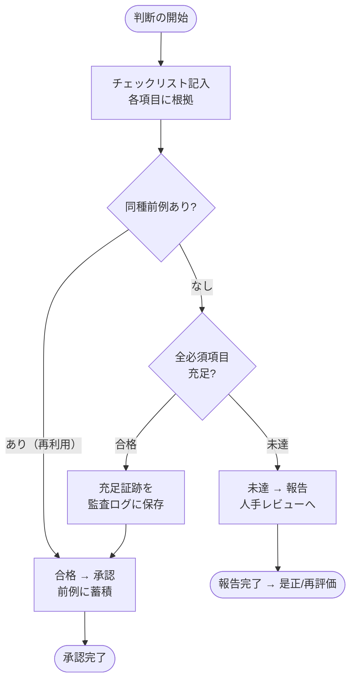

# プラットフォーム選択の検討（FlowOps デプロイ先）

> **目的**: FlowOps（GitOps for Business ＋ ガバナンス・ハーネス）を「どのプラットフォームで本番運用するか」を、
> アーキテクチャ上の事実にもとづいて比較し、推奨案を 1 つ提示する。
> ブランチ `claude/platform-choice-discussion-yk3frv` での議論用たたき台。

> [!NOTE]
> このドキュメントは音声メモ起点の依頼を、リポジトリの実装事実に照らして再構成したものです。
> スコープ（成果物の粒度・比較対象）に認識のズレがあれば指摘してください。修正します。

---

## 0. 決定（このリポジトリでの選定）

| 項目 | 内容 |
| --- | --- |
| **選定プラットフォーム** | **自前 Docker / VPS**（単一コンテナ常駐 ＋ 永続ボリューム ＋ PostgreSQL） |
| 決定日 | 2026-06-29 |
| 決定方式 | **判断チェックリスト・ゲート**（§9）を充足 → 合格（採用）。未達があれば報告（人手レビュー）へ |
| 根拠 | §2 の実装制約（永続FS・単一インスタンス整合）に最小コストで適合し、機密ガバナンスを自社管理しやすい（§4 / §5） |
| 証跡 | 本ドキュメント ＋ 本PRの差分・レビュー記録（充足の証跡として保存） |
| 再評価条件 | 同時利用者数・可用性SLAの要件が上振れした場合は AWS ECS Fargate へ再評価（§7 Step 2） |

> この決定は §8 のチェックリストを「合格／報告」で運用した結果です。判断の手続き自体を
> 再利用可能なワークフローとして `spec/flows/decision-checklist-gate.yaml` に定義しています。

---

## 1. 結論（先に要点）

**FlowOps は「単一インスタンス常駐 ＋ 永続・書込可能ファイルシステム」を前提とするステートフルなアプリ**です。
この性質が、選べるプラットフォームをかなり絞り込みます。

- ✅ **適合**: 自前 Docker / VPS、AWS ECS Fargate（＋永続ボリューム）、GCP Cloud Run / Azure Container Apps（＋永続ボリューム）など、**長時間稼働コンテナ**系
- ❌ **不適合（現状のまま）**: **Vercel をはじめとする純サーバーレス（FaaS）**。ローカル Git 作業ツリー・インプロセスロック・常駐前提と構造的に噛み合わない

**推奨**: 段階導入。
1. **staging を「単一コンテナ常駐 ＋ PostgreSQL ＋ 永続ボリューム」で先に確立**（既存 `docker-compose.yml` がほぼそのまま使える）
2. 本番は **AWS ECS Fargate（＋EFS ＋ RDS）** か **自前 VPS/Docker** の二択。`docs/aws-migration-goals.md` の既定（東京リージョン・ECS Fargate）を尊重するなら前者。コスト最優先なら後者。
3. **Vercel は当面、本体のホスト先には選ばない**（理由は §3.2／§5）。採用したい場合は §6 のアーキテクチャ分離が前提。

---

## 2. なぜ「プラットフォーム選択」が単純でないか（実装事実）

プラットフォームの良し悪しではなく、**このアプリの作り**が制約を生んでいます。

| 事実 | 根拠（コード） | 帰結 |
| --- | --- | --- |
| ローカル Git 作業ツリーに対し branch/commit/merge を実行 | `src/core/git/manager.ts`（`simple-git` を `process.cwd()` で初期化） | **永続・書込可能な FS が必須**。リクエスト毎に消える FS では正本（SSOT）が壊れる |
| 正本は `spec/flows/*.yaml` 等のファイル | `src/lib/flow-service.ts`（`FLOWS_DIR = process.cwd()/spec/flows`）ほか多数 | DB ではなくファイルが SSOT。FS の永続性がデータ整合性に直結 |
| Git 操作はロックで直列化 | `src/core/git/lock.ts` | 同時書込を防ぐ排他制御が前提 |
| そのロックは**インプロセス Mutex（メモリ内 `this.locked`）** | `src/core/git/lock.ts:22` | **複数インスタンス間では協調しない** → 事実上「単一インスタンス」or 分散ロック導入が必要 |
| LLM 呼び出し（Anthropic / OpenAI） | `@anthropic-ai/sdk`, `openai`（`package.json`） | 数十秒級の長時間処理。短いタイムアウトの FaaS と相性が悪い |
| ガバナンス・ハーネス（入口/出口ゲート・監査ログ） | `src/core/ingress` `src/core/egress` `src/core/audit` | 監査ログは追記専用で**自社保持が要件**。外部送出経路の統制が必要 |
| DB は SQLite/PostgreSQL を adapter で切替 | `@prisma/adapter-better-sqlite3` / `@prisma/adapter-pg` | 本番は PostgreSQL 推奨（`aws-migration-goals.md` §4 と一致）。SQLite も結局**永続ボリューム**が要る |

> 要するに **「ステートレスに水平スケールする」前提のプラットフォーム（≒サーバーレス）とは構造的に合わない**。
> 単一の常駐プロセスに永続ディスクをぶら下げる、という古典的な構成が最も素直です。

---

## 3. 評価軸（何を基準に選ぶか）

| # | 軸 | なぜ重要か |
| --- | --- | --- |
| A | **永続・書込可能 FS** | Git 作業ツリーと `spec/*.yaml`（SSOT）の保存先。最優先・足切り条件 |
| B | **単一インスタンス整合（ロック）** | インプロセス Mutex 前提。水平スケールするなら分散ロックの追加実装が必要 |
| C | **長時間処理耐性** | LLM 呼び出し。リクエストタイムアウト・実行時間上限 |
| D | **機密ガバナンス適合** | 監査ログ自社保持・egress 統制・機密の外部送出制御 |
| E | **DB（PostgreSQL）** | 本番可用性。マネージド DB の有無 |
| F | **コスト** | 月額・従量の見積りやすさ |
| G | **運用負荷** | 監視・デプロイ・スケール・パッチ |
| H | **本番可用性** | 冗長化・自動復旧・SLA |

### 3.1 足切り（軸 A・B）

軸 A（永続 FS）と軸 B（単一インスタンス整合）を**両方満たせないものは現状のまま採用不可**。

### 3.2 サーバーレス（Vercel 等）が落ちる理由

- 関数実行ごとに FS は基本リードオンリー／揮発（`/tmp` は一時的で共有もされない）→ 軸 A ✗
- 複数インスタンスへ自動スケール → インプロセスロックが効かない（軸 B ✗）
- 実行時間・ペイロード上限 → 長時間 LLM 処理に制約（軸 C △）
- ※ Next.js のホストとしては最良クラスだが、**「ローカル Git を回すバックエンド」としては不適合**

---

## 4. 候補プラットフォーム比較

凡例: ◎=得意 / ○=可 / △=条件付き / ✗=不適合

| 軸＼候補 | 自前 Docker / VPS | AWS ECS Fargate ＋ EFS ＋ RDS | GCP Cloud Run / Azure Container Apps ＋ 永続Vol | Vercel（純サーバーレス） |
| --- | --- | --- | --- | --- |
| A 永続FS | ◎（ローカルディスク） | ○（EFS マウント） | △（要 永続ボリューム設定／構成依存） | ✗ |
| B 単一整合 | ◎（1台運用が自然） | ○（タスク数=1 に固定すれば可） | △（min/max=1 に固定が必要・スケール思想と逆行） | ✗ |
| C 長時間処理 | ◎ | ◎ | ○（タイムアウト上限あり） | △ |
| D 機密ガバナンス | ◎（自社管理が容易） | ◎（VPC/Secrets/CloudTrail） | ○ | △（外部実行・ログ管理が増える） |
| E PostgreSQL | ○（自前 or マネージド） | ◎（RDS） | ◎（Cloud SQL / Azure DB） | △（外部 DB 必須） |
| F コスト | ◎（最安・小規模） | △（やや高・構成多） | ○ | ○（小規模は安いが本体不適合） |
| G 運用負荷 | △（自前で監視/冗長化） | △（学習コスト高・確立すれば堅牢） | ○ | ◎（運用ほぼ不要だが本体不適合） |
| H 可用性 | △（単機は単一障害点） | ◎（マルチAZ・自動復旧） | ◎ | ◎ |

### 4.1 各候補ひとことメモ

- **自前 Docker / VPS**: 既存 `docker-compose.yml` がそのまま使える最短路。小規模・コスト最優先・PoC〜社内運用に最適。弱点は可用性（単機は単一障害点）と運用の手作り。
- **AWS ECS Fargate（＋EFS＋RDS）**: `docs/aws-migration-goals.md` の既定路線。本番堅牢・東京リージョン・staging/production の二系統運用に向く。ただし EFS マウントとタスク数=1 固定（ロック整合）が設計上の要注意点。コスト・学習コストは高め。
- **GCP Cloud Run / Azure Container Apps**: コンテナ系で運用は軽いが、**「常駐＋永続ボリューム＋スケール0/1固定」**にすると本来の長所（自動スケール）を殺すことになり、旨味が薄い。AWS 既定がある以上、積極採用の理由は弱い。
- **Vercel**: Next.js フロントの配信は世界最良クラス。だが本体（ローカル Git バックエンド）のホストには不適合。採用するなら §6 の分離が前提。

---

## 5. 機密・ガバナンス観点（軸 D の深掘り）

FlowOps の差別化は「**器（AI 実行環境）は借り、統治（ポリシー・ゲート・監査）は自社で持つ**」点（README §冒頭）。プラットフォーム選択でも、

- **監査ログの所在**: 追記専用ログ（`src/core/audit`）は**自社管理ストレージ**に置けること。マネージド FaaS にログを散らさない。
- **egress 統制**: 出口ゲート（`src/core/egress`）で外部送出を絞る前提。ネットワーク境界（VPC/SG）を自社で握れるプラットフォームが望ましい → AWS / 自前が有利。
- **Secrets**: `.env` の機密は Git に入れない（`aws-migration-goals.md` §6）。Parameter Store / Secrets Manager 等のマネージド秘密管理を使えると安全。

→ この観点でも **AWS（VPC＋Secrets Manager＋CloudTrail）** または **自社管理の VPS** が筋。

---

## 6. もし Vercel を使いたいなら（分離アーキテクチャ）

「Next.js の良さを活かしたい」場合は、**フロント／表示系と Git バックエンドを分離**すれば両取りできる:

```
[Vercel] Next.js（UI・読み取り系・SSR） ──API──> [常駐コンテナ] Git バックエンド（commit/merge/lock・SSOT）
                                                      └─ 永続FS ＋ PostgreSQL ＋ 監査ログ
```

- Vercel = 表示と軽い API（読み取り・認証）
- 別の常駐サービス = 書込・Git 操作・ロック・監査（軸 A/B/D を満たす）

ただし**現状のコードは単一 Next.js アプリに一体化**しているため、この分離は**それなりの改修**を要する。短期の選択肢ではなく「将来やるなら」の位置づけ。

---

## 7. 推奨ロードマップ

1. **Step 1 — staging を常駐コンテナで確立（最優先・低コスト）**
   既存 `docker-compose.yml`（app＋PostgreSQL＋永続ボリューム）で staging を立てる。`aws-migration-goals.md` の品質ゲート（typecheck/lint/test/build）→デプロイの流れをここで固める。
2. **Step 2 — 本番プラットフォームの確定（二択）**
   - **本番堅牢・既定路線重視 → AWS ECS Fargate ＋ EFS ＋ RDS**（東京）。タスク数=1 固定（ロック整合）と EFS を設計に明記。
   - **コスト最優先・小規模 → 自前 VPS/Docker**。可用性は監視＋自動再起動で補う。
3. **Step 3（任意・将来）— UI と Git バックエンドの分離**
   水平スケールや Vercel 採用が要件化したら §6 の分離と分散ロックを導入。

> **未決事項（要・利用者判断）**
> - 本番は **AWS ECS Fargate** と **自前 VPS** のどちらを正式採用するか？（コスト vs 堅牢性）
> - 想定同時利用者数・可用性 SLA（単一インスタンスで足りるか、将来スケールが必要か）
> - 監査ログ・SSOT の保管要件（社内規程・保存期間・地理的制約）

---

## 8. 判断チェックリスト・ゲート（合格／報告 ＋ 証跡 ＋ 前例）

プラットフォーム選定のような**判断ポイント**は、毎回の感覚ではなく**チェックリストで「合格／報告」を切る**運用にする。
これはこのリポジトリのガバナンス思想（ゲート・承認・監査・前例）と同じで、判断の手続きを**再利用可能な拡張**として持つ。

**運用ルール**
- 各項目を「根拠（エビデンス）」つきで埋める
- **必須項目をすべて充足 → 合格（採用を承認）**
- **未達が1つでもあれば → 報告（人手レビューへエスカレーション）**。是正後に再評価、またはリスク受容を判断
- 充足の事実（項目・根拠・判定者・時刻）を**監査ログに証跡として保存**（再現性・説明責任）
- 同種の判断は**前例として再利用**（同条件なら軽量経路で承認）

> このワークフローの正本（SSOT）は `spec/flows/decision-checklist-gate.yaml`。本表はその「プラットフォーム選定」インスタンス。

### 8.1 プラットフォーム選定チェックリスト（今回の判定）

凡例: ✅=充足 / ⚠️=条件付き（要対応メモ） / ❌=未達

| # | 必須 | チェック項目（合格基準） | 自前 Docker/VPS の判定 | 根拠（エビデンス） |
| --- | --- | --- | --- | --- |
| A | ◎必須 | 永続・書込可能FSを確保できる | ✅ | ローカルディスク/ボリュームで Git 作業ツリー・`spec/*.yaml` を永続化（§2） |
| B | ◎必須 | 単一インスタンス整合（インプロセスロックが効く） | ✅ | 1台運用が自然。`src/core/git/lock.ts` のメモリ内 Mutex が成立 |
| C | ◎必須 | 長時間処理（LLM呼び出し）に耐える | ✅ | 常駐プロセスでタイムアウト制約なし |
| D | ◎必須 | 機密ガバナンス適合（監査ログ自社保持・egress統制） | ✅ | 自社管理ストレージ/ネットワーク境界を自前で掌握（§5） |
| E | ○推奨 | PostgreSQL を運用できる | ✅ | 同居 or マネージドDBで対応（`@prisma/adapter-pg`） |
| F | ○推奨 | コストが見積りやすく低廉 | ✅ | 小規模で最安。`docker-compose.yml` 流用で初期コスト小 |
| G | ○推奨 | 運用負荷が許容範囲 | ⚠️ | 監視・冗長化は自前。**要対応**: 監視＋自動再起動の手当て |
| H | ○推奨 | 本番可用性（冗長化・自動復旧） | ⚠️ | 単機は単一障害点。**要対応**: SLA要件次第で AWS Fargate へ再評価（§7 Step 2） |

**判定**: 必須項目 A–D は **全充足 ✅** → **合格（採用）**。推奨項目 G/H に ⚠️（要対応メモ）あり →
**「合格＋条件付き是正」**として承認し、是正タスク（監視・自動再起動／SLA再評価）をフォロー対象にする。
仮に必須項目に ❌ があれば、本来は **報告（人手レビュー）** へ回す。

### 8.2 ワークフロー図（再利用形）



---

## 9. 関連ドキュメント

- `docs/aws-migration-goals.md` — AWS（ECS Fargate / RDS / 東京）への既定移行方針
- `docs/governance/` — ガバナンス・ハーネス（入口/出口ゲート・監査・承認）
- `docker-compose.yml` / `Dockerfile` — 既存のコンテナ構成（staging の出発点）
- `src/core/git/manager.ts` / `src/core/git/lock.ts` — 本検討の制約根拠（ローカル Git ＋ インプロセスロック）
- `spec/flows/decision-checklist-gate.yaml` — 本決定で用いた「判断チェックリスト・ゲート」ワークフローの正本（再利用可能な拡張）
