# FlowOps ワークフローシステム ビジュアルガイド

> GitOps + AI オーケストレーション基盤の全体像と動作フロー

---

## 1. システム全体アーキテクチャ

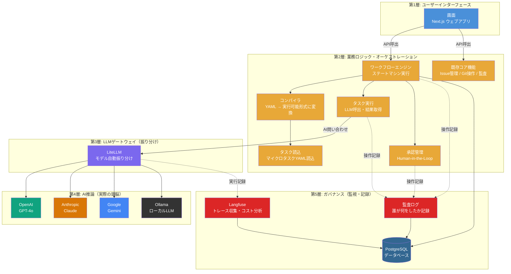

---

## 2. マクロ（フロー）とミクロ（タスク）の関係

FlowOpsでは、ビジネスプロセスを **2つのレイヤー** で管理します。

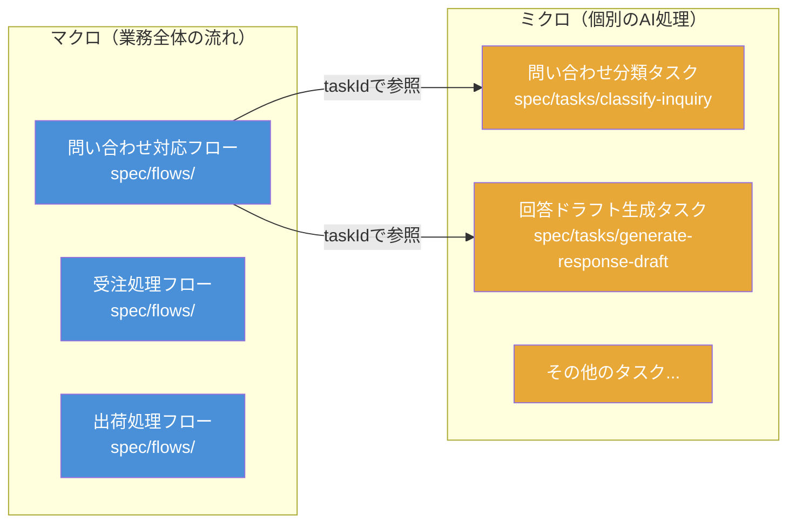

| | マクロ（フロー） | ミクロ（タスク） |
|---|---|---|
| **格納場所** | `spec/flows/*.yaml` | `spec/tasks/*.yaml` |
| **定義内容** | ビジネスプロセス全体（誰が・何を・どの順で） | 個別のAI操作（プロンプト・入出力スキーマ） |
| **接続方法** | ノードの `taskId` フィールドでタスクを参照 | フローから参照される |
| **バージョン管理** | Gitで変更履歴管理 | セマンティックバージョニング + Git |
| **実行時スナップショット** | コンパイル時に全タスクを読込・固定 | Gitコミットハッシュで実行時バージョンを記録 |

---

## 3. ノードタイプ一覧

ワークフローを構成する7種類のノード:

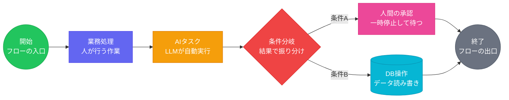

| ノードタイプ | 用途 | 特徴 |
|------------|------|------|
| `start` | ワークフロー開始点 | フローに1つ必須。入力データの受け取り |
| `end` | ワークフロー終了点 | 完了ステータスへ遷移 |
| `process` | 一般的な処理ステップ | 人間が行う業務プロセスの記録 |
| `llm-task` | AIタスク実行 | `taskId`で`spec/tasks/`のタスクを参照、LLMを自動呼出 |
| `decision` | 条件分岐 | エッジの`condition`で次のノードを決定 |
| `human-review` | 人間による承認 | ワークフローを一時停止し、承認/否認を待つ |
| `database` | DB操作 | データの読み書き（拡張用） |

---

## 4. サンプル: AI問い合わせ自動対応フロー

### 4.1 フロー図

`spec/flows/ai-inquiry-handling.yaml` の視覚化:

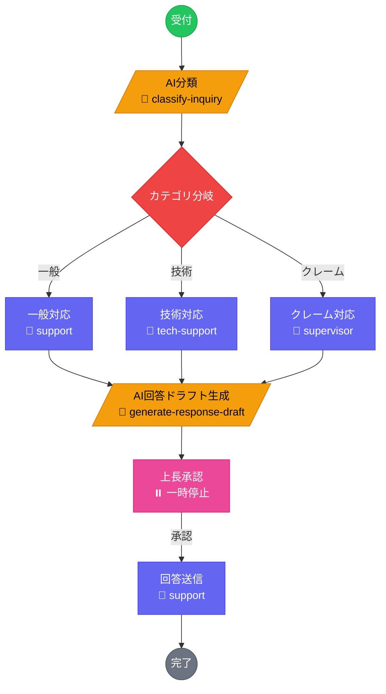

### 4.2 実行シーケンス

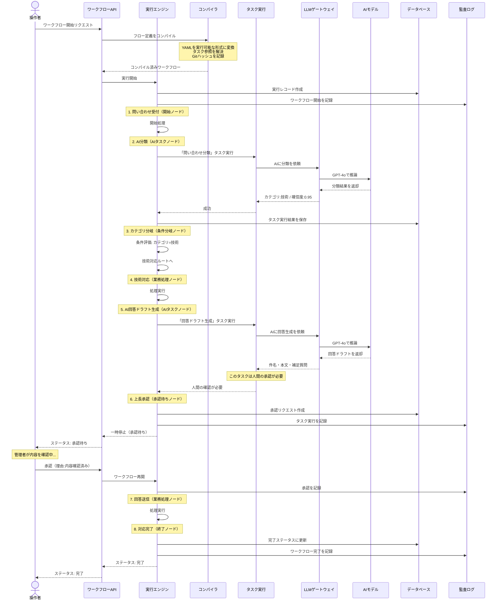

### 4.3 ステータス遷移

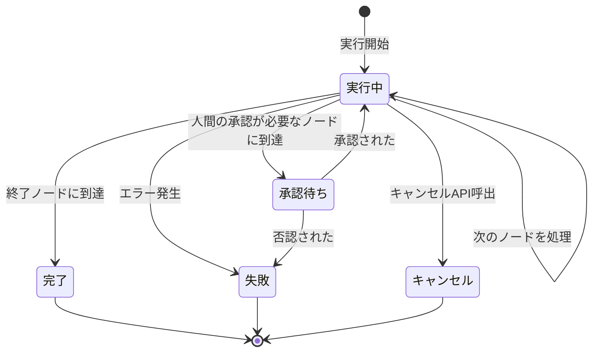

---

## 5. ワークフロー実行パイプライン

### 5.1 コンパイルフェーズ

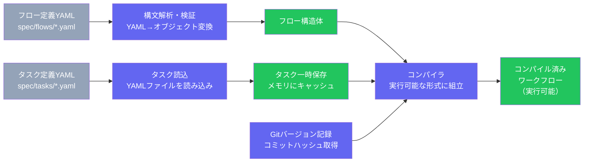

**コンパイル時に行われること:**
1. YAMLフロー定義をパース・検証
2. 各ノードの`taskId`参照を解決（`spec/tasks/`から読込）
3. 入出力スキーマの互換性チェック
4. Gitコミットハッシュを記録（再現性保証）
5. 実行可能なステートマシン(`CompiledWorkflow`)を生成

### 5.2 実行フェーズ

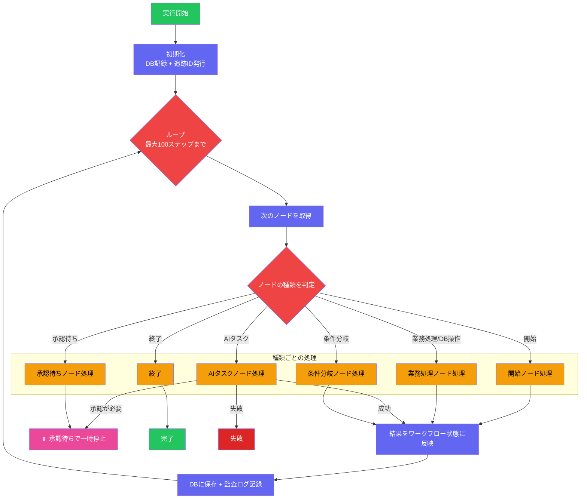

---

## 6. LLMタスク実行の詳細

`llm-task` ノードが処理される時の内部フロー:

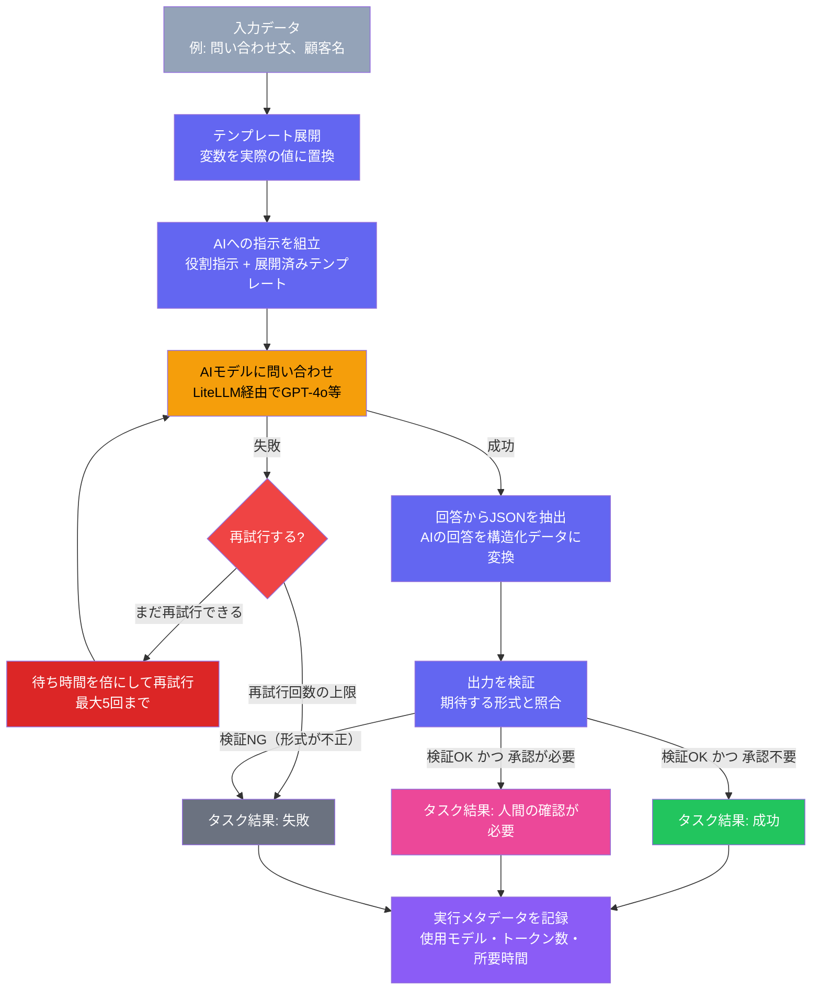

---

## 7. Human-in-the-Loop（承認フロー）

ISO/IEC 42001準拠の承認プロセス:

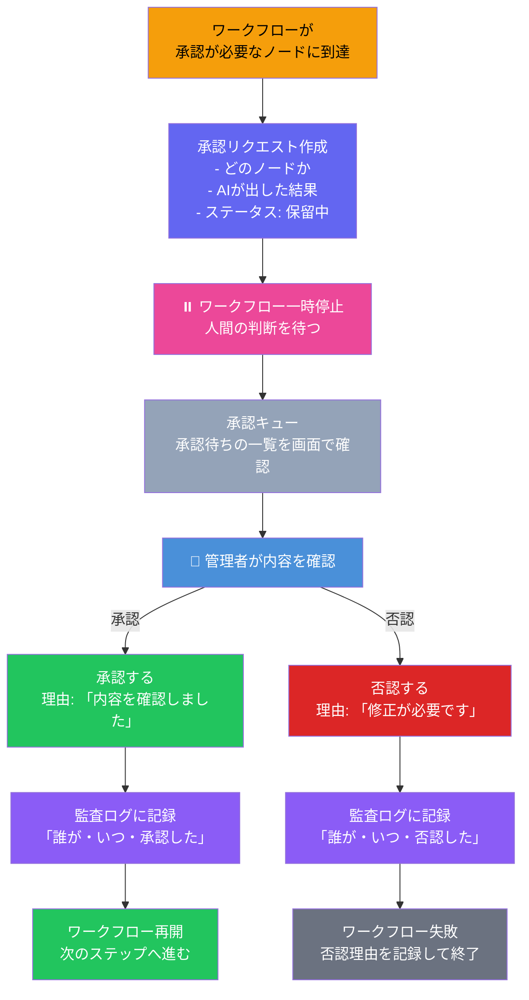

**ISO 42001 要件:**
- 承認/否認の **理由(reason)は必須**（空文字不可）
- 判断者(decidedBy)の記録
- 判断日時(decidedAt)の自動記録
- 全判断がTrace IDで追跡可能

---

## 8. Trace IDによるE2Eトレーサビリティ

1回のワークフロー実行で生成される全データが、単一のTrace IDで横断検索可能:

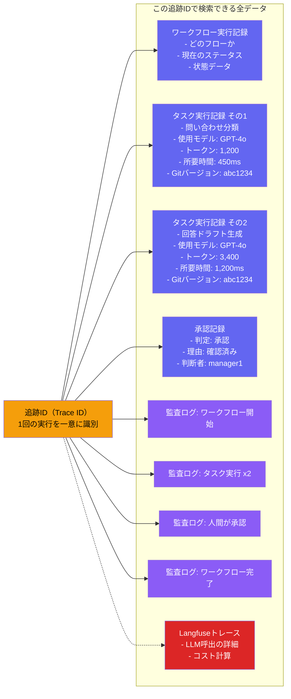

---

## 9. API エンドポイント一覧

### ワークフロー操作

| メソッド | パス | 説明 |
|---------|------|------|
| `POST` | `/api/workflows` | ワークフロー実行開始 |
| `GET` | `/api/workflows` | 実行一覧（status/flowIdフィルタ可） |
| `GET` | `/api/workflows/:id` | 実行状態の取得 |
| `POST` | `/api/workflows/:id/approve` | 承認/否認 |
| `POST` | `/api/workflows/:id/cancel` | キャンセル |

### タスク操作

| メソッド | パス | 説明 |
|---------|------|------|
| `GET` | `/api/tasks` | タスク定義一覧 |
| `GET` | `/api/tasks/:id` | タスク定義の詳細 |
| `POST` | `/api/tasks/:id/test` | ドライラン実行 |

### ガバナンス

| メソッド | パス | 説明 |
|---------|------|------|
| `GET` | `/api/governance/trace/:traceId` | Trace ID横断検索 |

---

## 10. データモデル

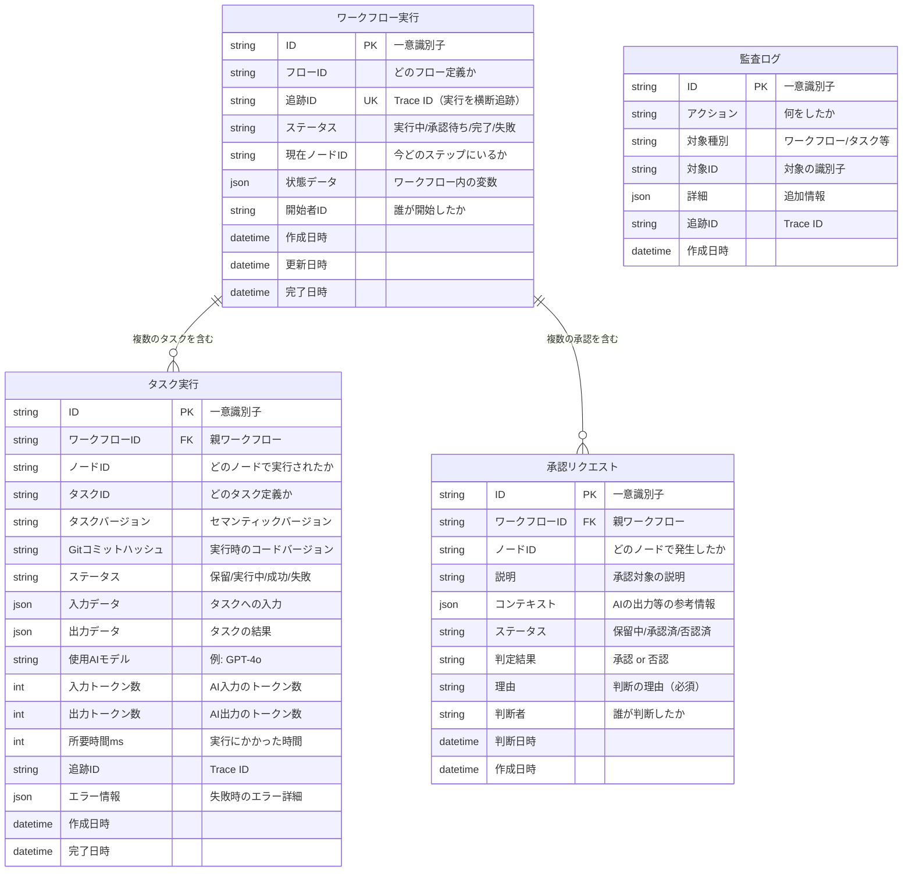

---

## 11. タスク定義の構造

`spec/tasks/*.yaml` の構造:

```yaml
# --- 識別情報 ---
id: classify-inquiry          # タスクID（ファイル名と一致）
version: "1.0.0"              # セマンティックバージョン
type: llm-inference           # タスクタイプ

# --- LLM設定 ---
llmConfig:
  model: "gpt-4o"             # LiteLLM経由のモデル名
  systemPrompt: |             # システムプロンプト
    あなたは問い合わせ分類システムです。
  userPromptTemplate: |       # Mustacheテンプレート
    問い合わせ内容: {{inquiry_text}}
  temperature: 0.1            # 0〜2（低い=決定的）
  maxTokens: 256              # 最大生成トークン数

# --- 入出力スキーマ ---
inputSchema:                  # JSON Schema形式
  type: object
  properties:
    inquiry_text: { type: string }
  required: [inquiry_text]

outputSchema:                 # JSON Schema形式
  type: object
  properties:
    category: { type: string, enum: [general, technical, complaint] }
    confidence: { type: number }

# --- 実行制御 ---
requiresHumanApproval: false  # true=実行後に人間承認が必要
maxRetries: 2                 # リトライ回数（0〜5）
timeoutMs: 15000              # タイムアウト（ms）

# --- メタデータ ---
metadata:
  author: "support-team"
  description: "問い合わせを自動分類"
  tags: [inquiry, classification]
```

---

## 12. インフラ構成

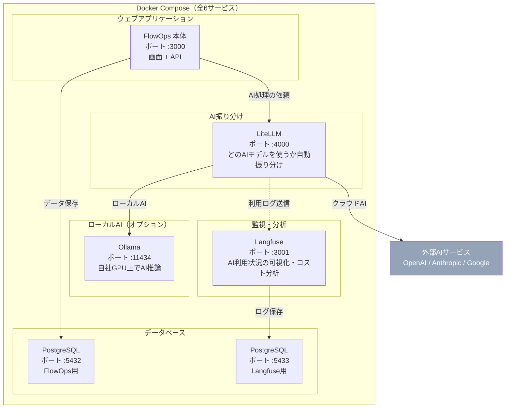

**起動コマンド:**
```bash
# 基本構成（外部LLMのみ）
docker compose up -d

# ローカルLLM追加
docker compose --profile local-llm up -d
```

---

## 13. クイックスタート: ワークフロー実行例

### Step 1: ワークフロー開始

```bash
curl -X POST http://localhost:3000/api/workflows \
  -H "Content-Type: application/json" \
  -d '{
    "flowId": "ai-inquiry-handling",
    "initiatorId": "operator-001",
    "inputData": {
      "inquiry_text": "ログインできません。パスワードを忘れました。",
      "customer_name": "田中太郎"
    }
  }'
```

**レスポンス:**
```json
{
  "data": {
    "executionId": "cm...",
    "traceId": "550e8400-e29b-41d4-...",
    "flowId": "ai-inquiry-handling",
    "status": "paused-human-review",
    "currentNodeId": "review"
  }
}
```

### Step 2: 承認待ちの確認

```bash
curl http://localhost:3000/api/workflows?status=paused-human-review
```

### Step 3: 承認

```bash
curl -X POST http://localhost:3000/api/workflows/{executionId}/approve \
  -H "Content-Type: application/json" \
  -d '{
    "approved": true,
    "reason": "AI生成の回答内容を確認しました。問題ありません。",
    "decidedBy": "manager-001"
  }'
```

### Step 4: トレース確認

```bash
curl http://localhost:3000/api/governance/trace/{traceId}
```

---

## 14. ファイル構成

```
d:\dev\GitOps\
├── spec/
│   ├── flows/                          # マクロ: ワークフロー定義
│   │   ├── ai-inquiry-handling.yaml    # AI問い合わせ対応フロー
│   │   ├── inquiry-handling.yaml       # 手動問い合わせ対応フロー
│   │   ├── order-process.yaml          # 受注処理フロー
│   │   └── shipping-process.yaml       # 出荷処理フロー
│   └── tasks/                          # ミクロ: タスク定義
│       ├── classify-inquiry.yaml       # 問い合わせ分類タスク
│       └── generate-response-draft.yaml# 回答ドラフト生成タスク
│
├── src/core/orchestrator/              # オーケストレーション（心臓部）
│   ├── schemas/
│   │   ├── micro-task.ts               # タスク定義Zodスキーマ
│   │   └── execution.ts               # 実行状態Zodスキーマ
│   ├── compiler.ts                     # YAML → ステートマシン変換
│   ├── engine.ts                       # ワークフロー実行エンジン
│   ├── task-loader.ts                  # タスクYAML読込
│   ├── task-registry.ts               # タスクキャッシュ
│   ├── task-executor.ts               # LLM呼出・タスク実行
│   ├── human-loop.ts                  # 承認フロー管理
│   └── index.ts                       # エクスポート集約
│
├── src/lib/
│   └── trace-context.ts               # Trace ID伝播 (AsyncLocalStorage)
│
├── infrastructure/
│   └── litellm/config.yaml            # LiteLLMルーティング設定
│
├── docker-compose.yml                 # 6サービス構成
└── docs/
    ├── architecture-ai-integration.md # アーキテクチャ設計書
    └── workflow-visual-guide.md       # 本ドキュメント
```
